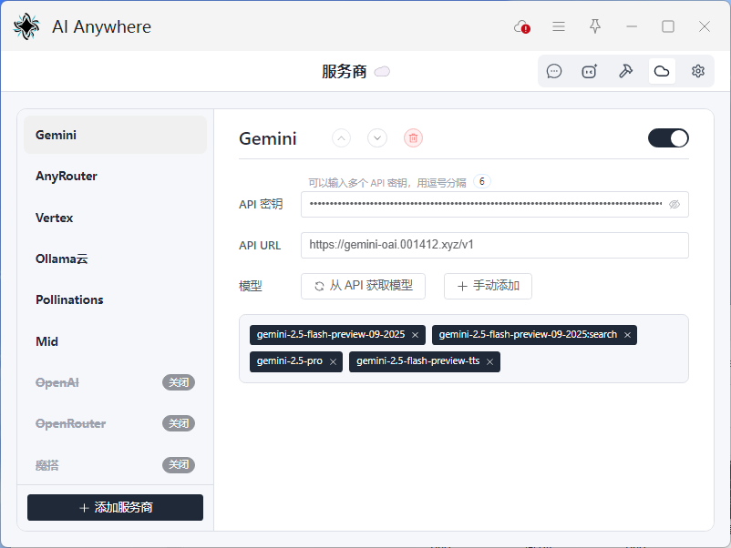
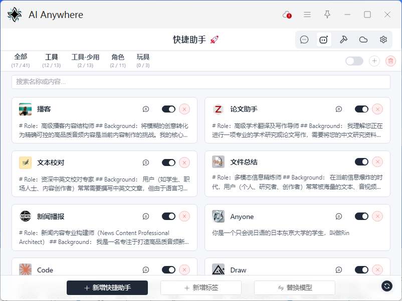
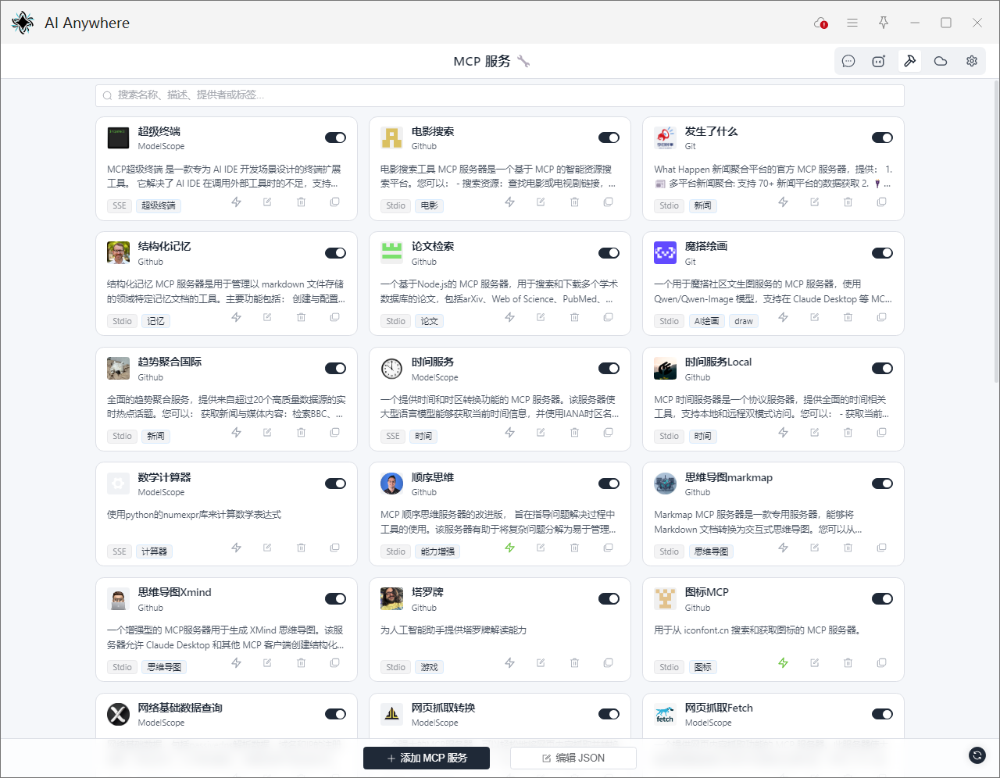
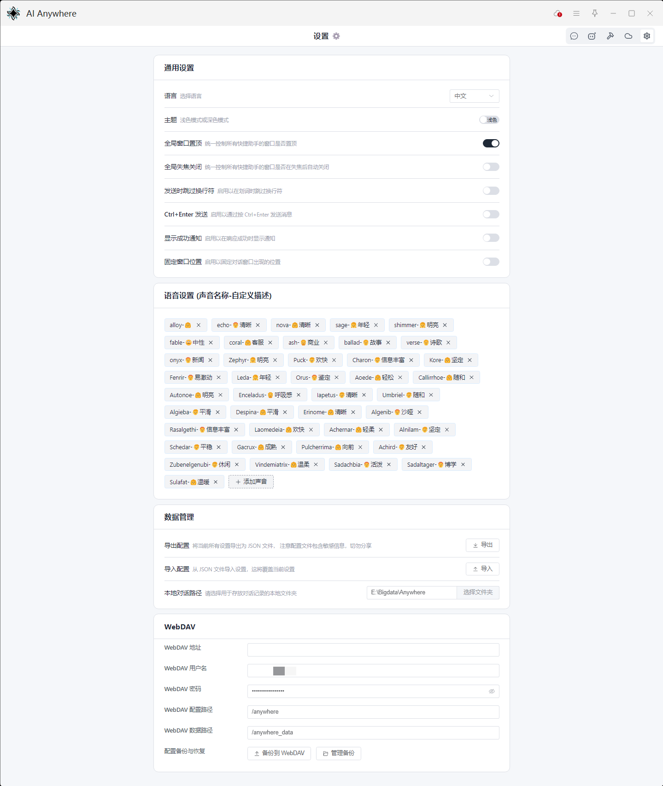

# AI Anywhere 详细使用教程

欢迎使用 AI Anywhere！本教程将引导您从零开始，全面掌握这款强大的 AI 助手，释放您的全部生产力。

---

## 目录

1. [**🚀 快速开始：三步配置**](#-快速开始三步配置)
   * [第一步：配置服务商 (Provider)](#第一步配置服务商-provider)
   * [第二步：创建你的第一个快捷助手 (Prompt)](#第二步创建你的第一个快捷助手-prompt)
   * [第三步：开始使用！](#第三步开始使用)
2. [**🧠 核心功能详解**](#-核心功能详解)
   * [对话窗口：你的 AI 工作台](#对话窗口你的-ai-工作台)
   * [快捷助手 (Prompts) 管理](#快捷助手-prompts-管理)
   * [服务商 (Providers) 管理](#服务商-providers-管理)
   * [MCP (模型上下文协议) 服务](#mcp-模型上下文协议-服务)
3. [**💾 数据同步与管理**](#-数据同步与管理)
   * [第一步：配置本地与云端路径 (重要)](#第一步配置本地与云端路径-重要)
   * [第二步：使用“对话”面板](#第二步使用对话面板)
   * [配置导入与导出](#配置导入与导出)
4. [**✨ 进阶技巧**](#-进阶技巧)
   * [模型后缀](#模型后缀)
   * [自定义语音角色](#自定义语音角色)
   * [搭配 uTools 快捷键](#搭配-utools-快捷键)

---

## 🚀 快速开始：三步配置

只需简单三步，即可开始您的 AI 之旅。

### 第一步：配置服务商 (Provider)

服务商是提供 AI 模型服务的源头。Anywhere 兼容所有 OpenAI API 格式的接口。

1. **进入“服务商”页面**
   
2. **添加服务商**
   * 点击左下角的“添加服务商”按钮。
   * 输入一个自定义名称（如“我的OpenAI”），点击“确认”。
3. **填写配置信息**
   * **API 密钥 (API Key)**：从您的 AI 服务提供商处获取。支持填入多个密钥，用英文逗号 `,` 分隔，插件会随机调用以提高可用性。
   * **API URL**：填写服务商的接口地址。
   * **获取模型**：填写完以上信息后，点击“从 API 获取模型”按钮，插件会自动拉取该服务商支持的模型列表。您也可以“手动添加”特定模型。

*服务商填写示例*

> **一些免费的服务**
>
> * **Google AI Studio**: 访问 [aistudio.google.com/apikey](https://aistudio.google.com/apikey) 获取免费 Gemini API 密钥。URL 可填写作者提供的中转接口 `https://gemini-oai-cf.141277.xyz/v1`。
> * **OpenAI**: 访问 [platform.openai.com/api-keys](https://platform.openai.com/api-keys) 获取密钥。免费账户可使用 `gpt-4o-mini` 等模型。URL: `https://api.openai.com/v1`。
> * **OpenRouter**: 访问 [openrouter.ai](https://openrouter.ai) 注册，可免费体验多种模型。URL: `https://openrouter.ai/api/v1`。

* **注意**：请确保您的 API 密钥和 URL 是正确的，否则插件将无法正常工作。
  * **API URL**：一般类似 `https://api.openai.com/v1`，查阅文档完整路径一般为 `https://api.openai.com/v1/chat/completions`，选择 `/chat/completions`之前的部分即可。
  * **API 密钥**：用于验证您的身份，确保您有权使用服务商提供的模型，有时也被称为token。

### 第二步：创建你的第一个快捷助手 (Prompt)

快捷助手是您与 AI 交互的入口，每个助手都可以拥有独特的指令、模型和行为。

1. **进入“快捷助手”页面**
   
2. **新增快捷助手**
   * 点击左下角的“新增快捷助手”按钮。
3. **填写核心配置**
   * **名称 (Name)**：为您的助手命名，例如“翻译助手”、“代码解释器”。这个名称就是您在 uTools 中呼出它的关键词。
   * **快捷助手内容 (Prompt Content)**：这里填写您给 AI 的核心指令，也就是“系统提示词 (System Prompt)”。例如，对于翻译助手，您可以填写：“你是一个专业的翻译引擎，请将我发送的任何内容翻译成英文。”
   * **模型 (Model)**：为您地助手选择一个合适的 AI 模型。下拉列表中会显示您在第一步中配置的所有可用模型。
4. **保存**
   * 点击“确认”按钮。恭喜，您的第一个 AI 助手创建成功！

*快捷助手配置示例*

* **提示**：可以在Utools的 `个人中心`->`快捷方式`中配置快捷按键
  * 右侧选中后表示支持划词调用，选中文本、图片、文件后点击快捷键即可调用
  * 右侧取消选中，选中文本、图片、文件后，需要复制后点击快捷键即可调用

*快捷键配置示例*

### 第三步：开始使用！

1. **呼出 uTools 主输入框 (默认为 `Alt + Space`)**。
2. **输入您的快捷助手名称**（例如“翻译助手”）。
3. **回车**，即可打开对话窗口，开始与您的专属 AI 助手对话！
   

---

## 🧠 核心功能详解

所有模式支持**划词、截图、选择文件**后调用

### 对话窗口：你的 AI 工作台

对话窗口是您与 AI 交互的主要界面

#### 多模态输入

* **文本**：直接输入、粘贴文字。
* **图片/文件**：可通过**拖拽**、**粘贴**或点击附件按钮**上传**。支持多种文档、代码、图片、音频格式。
* **截图**：如果您的快捷助手是“截图”类型，在未输入图片时会自动调用 uTools 的截图功能。

#### 语音交互

* 点击输入框左侧的**麦克风**图标，可以选择 **🎙️ 麦克风** 或 **💻 系统音频** 作为音源进行录音。
* 录音结束后，如果有文本在输入框中，将附带文本一同发送。
* 在快捷助手配置中设置“默认声音”，可让 AI 的回复以语音形式播放。
  * 注意使用正确的语音模型
  * 注意选择正确的声音，默认配置中，小写首字母为**OpenAI**系列语音模型支持的声音（例如alloy），大写首字母为**Gemini**系列语音模型支持的声音

#### 对话编辑与调整

* **编辑消息**：将鼠标点击对应消息操作栏中的“编辑”按钮，即可修改该条消息的内容。这对于纠正错误或微调上下文非常有用（编辑中可以使用快捷键，**ctrl+enter**保存更改，**Esc**取消更改）。
* **编辑系统提示词**：点击对话气泡中的系统提示词预览，可以随时修改当前助手的核心指令。如果当前对话并非基于已保存的快捷助手，修改并保存后会自动为您创建一个新的快捷助手（编辑中可以使用快捷键，**ctrl+enter**保存更改，**Esc**取消更改）。

#### 智能滚动与便捷导航

当您向上滚动查看历史记录时，右下角会浮现一组导航按钮，帮助您：

* **向上/向下**跳转到上一条/下一条消息。
* **向上/向下**跳转到第一条/最新条消息。

点击头像可实现对应角色的**消息折叠**，方便查阅指定消息

#### 窗口行为定制

* **保存窗口状态**：点击左上角的**助手图标**，可以保存当前窗口的**大小、位置和缩放比例**，作为该快捷助手的默认设置。
* **置顶与失焦关闭**：点击右上角的图钉/锁形图标，可以临时切换当前窗口的“置顶”和“失焦关闭”状态。

#### 高级功能 (MCP, 思考预算等等)

* **MCP 工具**：点击输入框操作栏的“锤子”图标，可以临时启用或禁用已配置的 MCP 工具，让 AI 具备联网、执行代码等超能力。
  * **持久连接**：大部分情况下，MCP 工具会在每次对话结束后自动关闭。但有些工具需要保持连接，例如[Serena](https://github.com/oraios/serena)、[Drawio-mcp](https://github.com/lgazo/drawio-mcp-server)，此时可以开启“持久连接”。
  * **uTools限制**：每个uTools插件可以同时进行5个连接，因此Anywhere进行了MCP优化，**非持久连接**MCP可以无限开启，只在AI调用时进行连接，在对话窗口的MCP选择的弹窗左下角有相应提示。
* **思考预算**：点击“灯泡”图标，可以临时调整本次对话的“思考预算”（快速、均衡、深入），影响 AI 回复的思考程度，仅仅对思考类型的模型有效（部分Deepseek服务商也不支持相关参数）。

### 快捷输入模式：便捷调用AI作为输入

依旧多模态输入，AI回复完成将自动复制并关闭，也可以拖拽文本符号到其他应用，将内容直接输入到对应文本框

### 快捷助手 (Prompts) 管理

这是配置所有 AI 功能的核心页面。

* **基础配置**：

  * **类型 (Type)**：决定了助手能被如何触发。
    * `通用`: 匹配文本、截图、文件。
    * `文本`: 仅匹配文本，支持自定义正则匹配。
      * **自定义正则匹配**：对于“文本”类型的助手，可以设置正则表达式，仅当选中的文本匹配该正则时，此助手才会出现在 uTools 的选项中。
    * `截图`: 如果剪切板存在图片，则直接打开窗口，否则开启截图工具。
    * `文件`: 仅匹配文件。
  * **显示模式 (Show Mode)**：
    * `独立窗口`: 推荐，功能最全的交互模式。
    * `快捷输入`: 出现通知框，AI回复完成将自动复制并关闭，也可以拖拽文本符号到其他应用，将内容直接输入到对应文本框
* **高级快捷助手配置1**：

  * **文本/截图/文件直接发送**：开启后，调用时如果有选中的文本、截图、文件，将直接发送，无需手动点击“发送”按钮。
  * **补充文本信息**：开启后，发送时自动追加时间信息，缓解一些服务商（vertex）不支持发送空字符串（例如只发送图片不发送文字）的情况。
  * **独立窗口设置**：为每个助手独立配置**窗口大小、位置、失焦关闭**等行为。
* **高级快捷助手配置2**：

  * **自定义温度**：为当前模型配置温度，更换模型后将变回默认温度（关闭温度参数，使用服务商服务器默认温度）。
  * **默认声音**：为当前模型（仅支持语音输出的模型）配置声音。
  * **默认MCP服务**：可以为某个助手预设启动时自动加载的 MCP 工具。
  * **默认思考预算**：为当前模型（仅支持思考预算调整的模型）配置默认的思考预算。
* **批量操作**：

  * **标签管理**：通过新增标签对助手进行分类管理。
  * **批量替换模型**：当您喜欢的模型更新换代时（例如 `gpt-4` -> `gpt-4o`），使用此功能可以一键更新所有使用旧模型的快捷助手。

### 服务商 (Providers) 管理

管理所有 AI 服务的来源。

* **排序**：在左侧服务商列表中，可以通过拖拽来调整服务商的显示顺序。
* **模型管理**：
  * 可以随时从 API 获取最新的模型列表。
  * 支持**拖拽模型列表**来调整它们在“快捷助手”配置页下拉菜单中的显示顺序。

### MCP (模型上下文协议) 服务

让您的 AI 长出双手，智能决策使用工具（实时热点、记忆、读写本地文件、获取网页信息、获取各种网络文档、画图等等）！

* **什么是 MCP？**：它允许 AI 调用外部工具，极大地扩展了 AI 的能力。Anywhere 基于精准的 Function Calling 实现此功能。
* **如何配置 MCP 服务**：您可以添加实现了 MCP 协议的服务，例如通过 Stdio 运行的本地 MCP 服务器，或是一个符合规范的 HTTP/SSE 服务。
  * **填写名称、描述**：方便使用者查看
  * **选择类型**： 支持 `stdio`、`http`、`sse` 三种类型（当前对于http名称各有讲法，皆进行兼容）。
  * **选择是否持久性连接**：大部分MCP服务不需要持久连接，而是即用即开，用完就走，一般不开。
    * **uTools的插件限制**：每个插件应用最多能同时建立5个连接，因此Anywhere进行了MCP优化，**非持久连接**MCP可以无限开启，只在AI调用时进行连接，在对话窗口的MCP选择的弹窗左下角有相应提示。
  * **对于sse/http类型**：
    * **基础 URL（必选）**：填写您的 MCP 服务器地址，例如 `http://localhost:3000`。
    * **请求头（可选）**：根据部分MCP服务器的需求，填写请求头信息，大部分不用管。
  * **对于stdio类型**（需要本地部署）：
    * **命令（必选）**：根据MCP库填写指令，常见的有 `npx`、`pnpm`、`node`、`uvx`等等，部分情况下，指令可能需要设置为绝对路径，例如  `node `设置为 `/user/local/bin/node`。
    * **参数（必选）**：根据MCP库填写，例如对于 `npx`命令，一般填写两行：`-y`和 `库名称`，对于 `pnpm`和 `node`命令，一般填写 `库路径`。
    * **环境变量（可选）**：根据部分MCP服务器的需求，填写环境变量信息，大部分不用管。
  * **高级/可选设置**
    * **服务商名称**：标识从哪里找到的MCP服务，例如 `Github`、`ModelScope`。
    * **图标链接**：对该服务使用图标标识。
    * **服务商链接**：MCP服务相关内容链接地址。
    * **标签**：对MCP服务进行标签标记，英文逗号分隔。
* **持久连接是什么？**：对于某些需要一直运行的MCP服务（如[Serena](https://github.com/oraios/serena)、[Drawio-mcp](https://github.com/lgazo/drawio-mcp-server)），开启“持久连接”可以确保其稳定性。注意：uTools 限制最多同时存在 5 个持久连接，但 Anywhere 的智能管理机制让您可以配置任意多个，它会按需加载。

---

## 💾 数据同步与管理

### 第一步：配置本地与云端路径 (重要)

1. **进入“设置”页面**。
   
2. **设置本地对话路径**：在“数据管理”卡片中，找到“本地对话路径”，点击“选择文件夹”，指定一个您电脑上的文件夹用于存储聊天记录。**这是启用本地管理和自动保存的前提**。
3. **配置 WebDAV**：填写您的 WebDAV 服务器信息（地址、用户名、密码）。`配置路径`用于存储插件本身的设置备份，`数据路径`用于存储聊天记录备份。

### 第二步：使用“对话”面板

配置好路径后，进入“对话”面板，您会看到一个全新的数据管理中心。

* **本地 vs. 云端**：您可以在“本地对话”和“云端对话”两个视图之间切换。
* **自动保存机制**：
  * 当您**保存一个对话**（到本地或云端）、**从本地/云端打开一个对话**，或**通过 `.json`文件加载一个对话**后，该对话即被“命名”。
  * 对于所有**已命名**的对话，Anywhere 会**每隔15秒自动将其保存到您的本地对话路径**，确保您的重要谈话内容不会丢失。
* **智能同步**：
  * 点击右上角的 **上传(↑)** 和 **下载(↓)** 按钮。
  * **智能上传**：插件会自动检测本地比云端更新或云端不存在的文件，并提示您可以一键上传的数量。
  * **智能下载**：反之，检测云端比本地更新或本地不存在的文件，并提示您可以一键下载的数量。
* **注意**：
  * 对于详细的对话，可以强制更新到云端进行覆盖，或者强制从云端拉取到本地进行覆盖
  * 传入云端的对话其修改实践将是上传成功的时间，而非本地的最后修改时间

### 配置导入与导出

在“设置”页面的“数据管理”卡片中，您可以：

* **导出配置**：将包括快捷助手、服务商在内的所有设置保存为一个 `.json` 文件。
* **导入配置**：通过选择一个之前导出的 `.json` 文件，恢复或迁移您的所有设置。

---

## ✨ 进阶技巧

### 模型后缀

在使用作者提供的免费中转站时（[可以自行部署该中转项目](https://github.com/Komorebi-yaodong/openai-gemini)），您可以在手动添加模型时，为模型名称增加后缀以启用特殊功能：

* `:search` - 让模型具备联网搜索能力。
* `:url` - 让模型能够读取并总结您提供的网页链接。
* `:execode` - 赋予模型执行代码的能力。

**示例**：在“服务商”页面手动添加模型 `gemini-2.5-flash:search`。

### 自定义语音角色

在“设置”页面的“语音设置”卡片中，您可以添加、编辑或删除用于语音输出的声音角色列表。格式为 `声音ID-自定义描述`，例如 `alloy-女声`。插件调用时会根据 `-` 前的ID部分识别声音，后部分的自定义描述帮助用户记录声音相关信息。

### 搭配 uTools 快捷键

uTools 允许为任何插件的任何功能指令或匹配指令设置全局快捷键。

1. 进入 uTools 设置 -> 全局快捷键。
2. 点击“新增”。
3. 在“功能”输入框中，输入您的**快捷助手名称**。
4. 设置您喜欢的快捷键组合。
5. 现在，无论在任何地方，按下该快捷键即可直接启动对应的 AI 助手！

