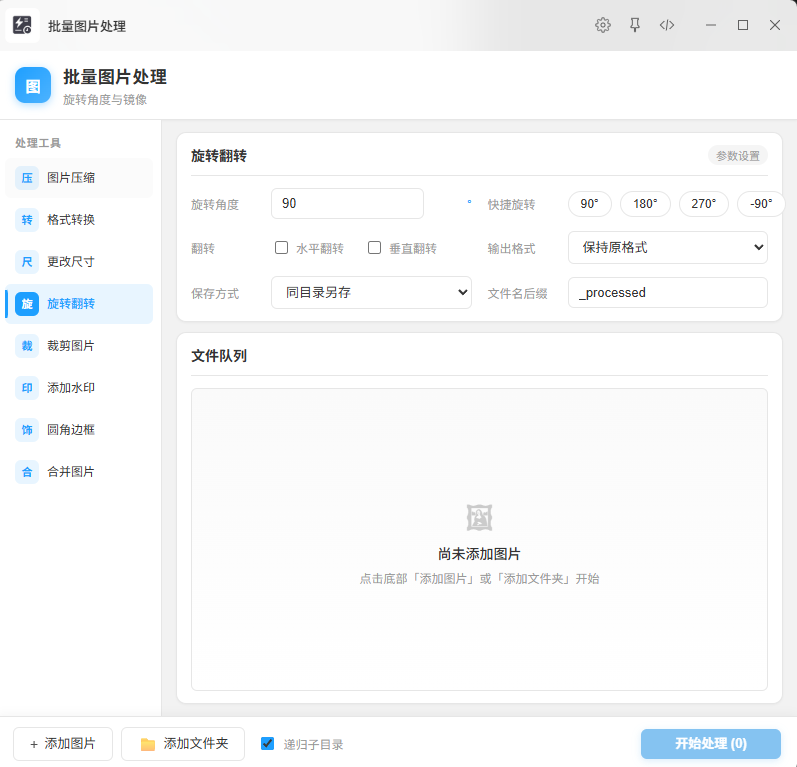
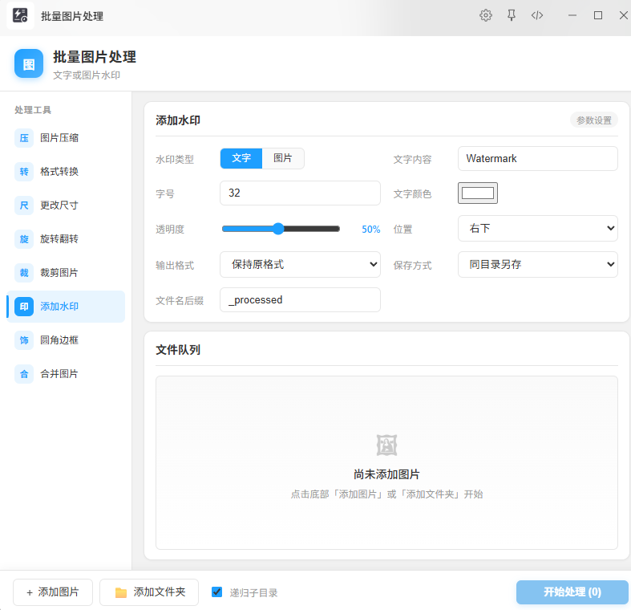
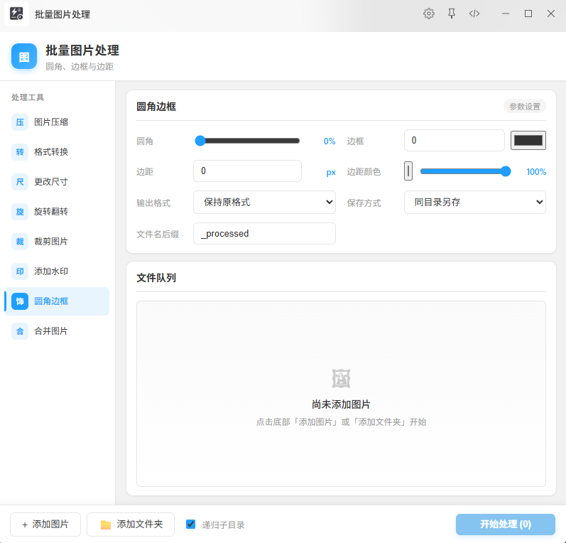
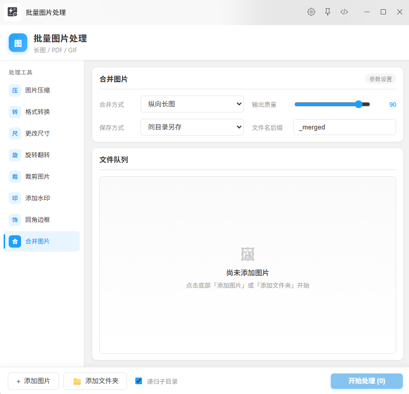

# 批量图片处理

ZTools 插件：批量压缩、格式转换、缩放、裁剪、水印、合并等图片处理工具。


## 功能预览

### 图片压缩

质量滑块 / 目标体积（KB），支持保持原格式或指定输出。


### 格式转换

JPEG / PNG / WebP / AVIF / TIFF / GIF / BMP / ICO。


### 更改尺寸

像素或百分比缩放，可锁定宽高比、禁止放大。


### 旋转翻转

任意角度旋转，水平 / 垂直翻转。



### 裁剪图片

拖拽裁剪框调整区域，或使用快捷比例 / 比例居中裁剪。


### 添加水印

文字或图片水印，可调透明度与位置。



### 圆角边框

圆角、描边、边距与透明度。



### 合并图片

纵向 / 横向长图、PDF、动画 GIF。



### 批量重命名

序号模板（前缀 + 起始序号 + 位数）或查找替换；原地改名，目标名冲突则跳过。

## 功能列表

- 批量选择图片或文件夹（支持递归子目录）
- 拖入图片文件 / 文件夹到 ZTools 触发
- 粘贴图片到 ZTools 触发
- 图片压缩（质量 10–100 / 目标体积）
- 格式转换（保持原格式或指定输出）
- 更改尺寸（像素 / 百分比）
- 旋转、水平 / 垂直翻转
- **拖拽裁剪**（自由调整区域，或快捷比例锁定）
- 比例居中裁剪
- 文字 / 图片水印
- 圆角、边框、边距
- 合并长图 / PDF / 动画 GIF
- **批量重命名**（序号模板 / 查找替换）
- 结果提示与错误提示可关闭；顶部可一键重置
- 保存方式：同目录另存、覆盖原图、指定输出目录

## 触发指令

- 文本：`批量图片` / `图片处理` / `图片压缩`
- 拖入图片文件
- 拖入文件夹
- 粘贴图片

## 本地安装（推荐自测）

```bash
npm run setup
npm run pack
```

生成 `batch-image-tools.zip` 后：

1. 打开 ZTools → **设置 → 已安装插件**
2. 右上角 **更多 → 导入本地插件**
3. 选择 `batch-image-tools.zip`（不支持选择文件夹）
4. 搜索「批量图片」打开插件

改代码后重复 `npm run pack` 并重新导入即可覆盖。

## 开发

```bash
npm run setup
npm run dev
```

开发服务器默认：`http://127.0.0.1:5173/index.html`

已导入本地插件时，`plugin.json` 中的 `development.main` 会走 Vite 热更新（UI）。  
**preload / sharp 相关改动**需重新 `npm run pack` 导入，或同步到插件目录后重启插件。

浏览器直接打开 Vite 地址仅可预览 UI，完整图片处理请在 ZTools 中运行。

## 构建

```bash
npm run build
```

产物在 `dist/`。也可用：

```bash
npm run pack   # build + 打 zip
```

## 发布到插件中心

参考 [ZTools 第一个插件文档](https://ztoolscenter.github.io/ZTools-doc/first-plugin.html)：

```bash
# 工作区需干净（勿提交 dist/、*.zip）
git add .
git commit -m "your changes"
git push

ztools publish
```

发布前请更新 `CHANGELOG.md` 与 `public/plugin.json` 中的 `version`。

## 项目结构

```
batch-image-tools/
├── static/images/          # README 功能截图
│   ├── overview.png
│   ├── feature-compress.png
│   ├── feature-convert.png
│   ├── feature-resize.png
│   ├── feature-rotate.png
│   ├── feature-crop.png
│   ├── feature-watermark.png
│   ├── feature-style.png
│   └── feature-merge.png
├── public/                 # 插件静态资源
│   ├── plugin.json
│   ├── logo.png
│   └── preload/
├── scripts/
├── src/BatchImage/
├── CHANGELOG.md
└── package.json
```

## License

MIT
