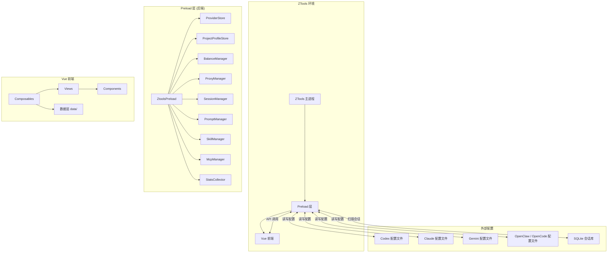

<p align="center">
  
</p>

<h1 align="center">CCToggle</h1>

<p align="center">
  <strong>ZTools 插件 | AI CLI 一键切换工具</strong>
</p>

<p align="center">
  为 Codex、Claude、Claude Desktop、Gemini、OpenClaw、OpenCode 等主流 AI CLI 工具管理多套 API 配置，点击即可切换 baseUrl、模型、密钥等参数，无需手动改配置文件。
</p>

---

## ✨ 功能特性

- 🔄 **一键切换** - 快速切换不同 AI 服务供应商的配置，实时改写 Agent 配置文件
- ⚡ **快速切换** - 在 uTools 搜索框输入 `cc {Agent名}` 直接打开插件并切到对应 Agent 页签
- 👥 **项目配置方案** - 为不同项目保存多套独立配置（API Key 按方案 AES-256-GCM 加密存储）
- 💰 **余额查询与告警** - 供应商卡片内嵌余额展示、低余额项目级告警去重
- 🌐 **内置代理** - 自带代理服务器，支持路由组、负载均衡、接管/还原 Agent 配置
- 📊 **用量统计** - 统计各 Agent 的调用量与 Token 消耗，支持模型用量排行
- 💬 **会话管理** - 扫描并浏览各 Agent 的会话记录（含 SQLite 格式），支持详情、恢复命令、导出
- 📝 **提示词管理** - 多 Agent 提示词 CRUD、备份恢复、OpenClaw 多文件人设包
- 🔌 **MCP 管理** - MCP Server 配置管理，支持从 Agent 配置文件同步
- 📦 **技能管理** - 安装社区技能、嵌套存储目录管理、按 复制/软链接 方式部署到各 Agent
- 🎯 **预设配置** - 内置 80+ 主流供应商预设，开箱即用
- 🎨 **多主题** - 内置 Amber / Midnight / Deepnight 三套主题

## 🚀 支持的 AI 工具

| 工具               | 说明                  | 快速切换 | 会话 | MCP | 提示词 |
| ------------------ | --------------------- | :------: | :--: | :-: | :----: |
| **Codex**          | OpenAI Codex CLI      |    ✅    |  ✅  | ✅  |   ✅   |
| **Claude**         | Anthropic Claude Code |    ✅    |  ✅  | ✅  |   ✅   |
| **Claude Desktop** | Claude 桌面版         |    ✅    |  —   | ✅  |   —    |
| **Gemini**         | Google Gemini CLI     |    ✅    |  ✅  | ✅  |   ✅   |
| **OpenClaw**       | OpenClaw CLI          |    ✅    |  ✅  | ✅  |   ✅   |
| **OpenCode**       | OpenCode CLI          |    —     |  ✅  | ✅  |   ✅   |

## 📦 支持的供应商

内置 80+ 家供应商预设，覆盖以下类别：

### 官方供应商

- OpenAI Official · Claude Official (Anthropic) · Google Official · Azure OpenAI

### 国内官方

- DeepSeek · Kimi / Kimi For Coding · 通义千问 (Qwen Coder / Bailian) · 豆包 (DouBaoSeed) · MiniMax · 智谱 (Zhipu GLM) · 小米 MiMo · 百度千帆 · 阿里百炼 · 火山引擎 (BytePlus / AgentPlan) · KAT-Coder · Longcat

### 聚合平台

- OpenRouter · SiliconFlow · AiHubMix · ModelScope · Novita AI · NVIDIA · CraxyRouter · Unity2.ai · 更多...

### 第三方 / 云厂商

- AWS Bedrock · GitHub Copilot · xAI (Grok) · 及大量合作伙伴供应商

## 📸 截图

<p align="center">
  
  
  
  
  
  
  
  
</p>

## 🛠️ 安装使用

### 前置要求

- [ZTools](https://ztoolscenter.github.io/ZTools-doc/) - 跨平台效率工具

### 安装插件

1. 打开 ZTools
2. 搜索 `cctoggle`
3. 安装插件

### 开发环境

```bash
# 克隆项目
git clone <your-repo>/ZTools-cctoggle.git
cd ZTools-cctoggle

# 安装依赖
pnpm install

# 启动开发服务器（ZTools 模式）
pnpm dev:all

# 启动开发服务器（浏览器模式，不需要 ZTools）
pnpm dev:browser

# 构建生产版本
pnpm build

# 类型检查
pnpm type-check

# E2E 测试（Playwright，自动拉起 dev:browser）
pnpm test:e2e
```

开发模式通过 `VITE_DEV_TARGET` 环境变量区分（`env/.env` = uTools，`env/.env.browser` = 浏览器），浏览器模式走 `dev-api-server.cjs` 的 mock API，可真实读写 CLI 配置文件。

### 开发技能

本项目内置了 ZTools 插件开发技能，克隆项目后在 opencode 中打开即可自动加载：

- 技能文件位于 `.opencode/skills/ztools-plugin/SKILL.md`

## 🧪 自动化测试

基于 [Playwright](https://playwright.dev/) 的端到端（E2E）测试。

### 运行测试

```bash
# 运行全部 E2E 测试
pnpm test:e2e

# UI 模式（可视化运行/调试）
pnpm test:e2e:ui
```

### 工作原理

- 测试配置：`playwright.config.ts`
  - 测试目录：`test/`（按模块分子目录：`providers` / `proxy` / `skills` / `mcp` / `settings` / `stats` / `widgets`）
  - 浏览器：Chromium（`Desktop Chrome`）
  - 自动启动开发环境：配置了 `webServer`，运行 `pnpm dev:browser`（浏览器模式 + dev API server），`baseURL` 为 `http://localhost:5273`
- 测试产物：HTML 报告输出到 `test-results/report/`，失败截图/轨迹到 `test-results/artifacts/`
- CI 行为：设置 `CI` 环境变量后自动启用 `forbidOnly`、`retries: 2`、单 worker
- `test-results/` 已加入 `.gitignore`，不进入版本库

### 编写测试

在 `test/` 下对应模块目录创建 `*.spec.ts`，沿用现有 Playwright 约定（`page.goto('/')` + 断言即可）。运行前请先 `pnpm install` 并确保 5273 端口未被占用。

技能文件位于 `.opencode/skills/ztools-plugin/SKILL.md`，另有 `docs/需求/` 目录存放各功能需求文档。

## 📖 使用说明

### 基本使用

1. 呼出 ZTools 搜索框
2. 输入 `cc` 或 `cctoggle` 唤起插件
3. 选择要使用的 AI 工具（Codex/Claude/Claude Desktop/Gemini/OpenClaw/OpenCode）
4. 点击供应商卡片即可切换配置

### 快速切换

在 uTools 搜索框直接输入 `cc Codex`、`cc Claude` 等命令，即可打开插件并自动切到对应 Agent 页签（可在设置中开关或修改前缀）。

### 项目配置方案

为不同项目保存独立的多套配置，切换到某方案时自动应用对应的 API Key / 模型 / baseUrl 组合。API Key 使用 AES-256-GCM 加密后按方案独立存储。

### 余额查询

供应商卡片可展示余额，支持低余额阈值与项目级告警去重（标记持久化于项目文档，跨会话不重复推送）。

### 代理模式

插件内置代理服务器，可以：

- 统一管理 API 密钥
- 自动负载均衡
- 记录请求日志
- 统计用量数据

### 路由配置

支持配置路由组，实现：

- 多供应商轮询
- 故障自动切换
- 自定义路由规则

### Skill 存储

设置页可配置技能嵌套存储目录（`~/.cctoggle/skills`）与同步方式（复制 / 软链接，Windows 用 junction 免特权）。

## 🏗️ 项目结构

### 📁 目录树

```
ztools-cctoggle/
├── public/                          # 静态资源
│   ├── logo.png                     # 插件图标
│   ├── plugin.json                  # ZTools 插件配置
│   └── preload/                     # 编译产物（自动生成，含小组件与 agents 图标）
│
├── src/
│   ├── preload/                     # 🔧 后端模块（ZTools preload 环境）
│   │   ├── preload.ts               # 主入口：ZtoolsPreload，API 暴露
│   │   ├── agents/                  # 按 Agent 拆分的适配器
│   │   │   ├── mcp/                 # McpManager + 各 Agent Adapter
│   │   │   ├── sessions/            # SessionManager + 各 Agent Adapter
│   │   │   ├── stats/               # StatsCollector + 各 Agent Adapter
│   │   │   ├── prompts.ts           # PromptManager - 提示词管理
│   │   │   └── skills.ts            # SkillManager - 技能部署
│   │   ├── config/                  # 配置读写（函数式）
│   │   │   ├── config-rw.ts         # 各 Agent 配置文件读写
│   │   │   └── proxy-converter.ts   # 代理协议转换（独立窗口运行）
│   │   ├── core/                    # 基础设施
│   │   │   ├── cleanup.ts           # DataMigration - 数据迁移清理
│   │   │   ├── crypto.ts            # AES-256-GCM 加解密
│   │   │   ├── sqlite.ts            # SQLite 读写
│   │   │   └── test-connection.ts   # ConnectionTester - 连接测试
│   │   ├── providers/               # 供应商数据层
│   │   │   ├── provider-db.ts       # ProviderStore - 供应商 CRUD
│   │   │   ├── profile-db.ts        # ProjectProfileStore - 配置方案
│   │   │   └── balance.ts           # BalanceManager - 余额查询
│   │   ├── widgets/                 # 🪟 桌面小组件（独立窗口，不走主入口）
│   │   │   ├── widget-manager.ts    # WidgetManager：窗口生命周期 + 事件广播
│   │   │   ├── widget-bus.ts        # 小组件侧事件订阅器
│   │   │   ├── widget-events.ts     # 事件通道注册表
│   │   │   ├── assets/              # 小组件公共资源
│   │   │   │   ├── widget-common.css # 公共样式（主题/工具条/置顶按钮）
│   │   │   │   └── images/agents/   # Agent 图标（小组件运行时引用）
│   │   │   └── status/              # 小组件：当前供应商余额
│   │   │       ├── status-preload.ts  # 小组件 preload（直接 require manager，不走 IPC）
│   │   │       └── status.html        # 小组件页面（构建时复制到 public/preload/widgets/status/）
│   │   ├── proxy/                   # 代理服务器
│   │   │   ├── proxy.ts             # ProxyManager - 路由组、启停、接管
│   │   │   └── proxy-daemon.ts      # 代理守护进程（独立窗口运行）
│   │   ├── widgets/                 # 🪟 桌面小组件（独立窗口，不走主入口）
│   │   │   ├── widget-manager.ts    # WidgetManager：窗口生命周期 + 事件广播
│   │   │   ├── widget-bus.ts        # 小组件侧事件总线订阅
│   │   │   ├── widget-events.ts     # 主窗↔小组件事件通道常量
│   │   │   ├── assets/              # 公共资源（widget-common.css + agents 图标）
│   │   │   └── status/              # 小组件：当前供应商余额
│   │   │       ├── status.html
│   │   │       └── status-preload.ts
│   │   └── utils.ts                 # 工具函数与路径常量

│   │
│   ├── components/                  # 🧩 Vue 组件
│   │   ├── common/                  # AppDashboard / AppFooter / TabBar / EChart
│   │   ├── provider/                # ProviderCard / ProviderForm / PresetChips / BalanceCard
│   │   ├── session/                 # SessionCard / SessionDetail
│   │   ├── prompt/                  # PromptCard / PromptEditor / PromptPreview
│   │   ├── mcp/                     # McpCard / McpForm
│   │   ├── skills/                  # SkillInstallSection / SkillListSection
│   │   └── routes/                  # RoutesSection
│   │
│   ├── composables/                 # 🎣 组合式函数
│   │   ├── shared.ts                # 共享常量与工具
│   │   ├── useProviders.ts          # 供应商管理
│   │   ├── useQuickSwitch.ts        # 快速切换命令注册
│   │   ├── useProfiles.ts           # 项目配置方案
│   │   ├── useBalance.ts            # 余额展示与告警
│   │   ├── useRoutes.ts             # 路由组管理
│   │   ├── useSession.ts            # 会话管理
│   │   ├── usePrompts.ts            # 提示词管理
│   │   ├── useSkills.ts             # 技能管理
│   │   ├── useMcp.ts                # MCP 管理
│   │   ├── useStats.ts              # 用量统计
│   │   ├── useAiOptimize.ts         # 提示词 AI 辅助优化
│   │   └── useTheme.ts              # 主题切换
│   │
│   ├── data/                        # 📊 数据定义
│   │   ├── providers.ts             # 供应商元数据（80+）
│   │   ├── presets.ts               # 预设入口
│   │   ├── presets-codex.ts         # Codex 预设
│   │   ├── presets-claude.ts        # Claude 预设
│   │   ├── presets-claude-desktop.ts# Claude Desktop 预设
│   │   ├── presets-gemini.ts        # Gemini 预设
│   │   ├── presets-openclaw.ts      # OpenClaw 预设
│   │   ├── prompt-templates.ts      # 提示词模板
│   │   └── balance-templates.ts     # 余额查询模板
│   │
│   ├── themes/                      # 🎨 主题配置
│   │   ├── index.ts / buildOverrides.ts
│   │   ├── amber.ts / midnight.ts / deepnight.ts
│   │
│   ├── types/                       # 📝 TypeScript 类型
│   │   ├── ztools-cctoggle.d.ts    # preload API 接口类型
│   │   └── env.d.ts                 # 环境类型
│   │
│   ├── utils/                       # 🛠️ 前端工具
│   │   ├── browser-adapter.ts       # 浏览器开发适配器
│   │   ├── markdown.ts              # Markdown 渲染（代码高亮）
│   │   ├── openUrl.ts / debounce.ts
│   │
│   ├── router/index.ts              # 路由配置
│   ├── views/                       # 📄 页面视图
│   │   ├── ProviderListPage.vue     # 供应商列表页
│   │   ├── SessionPage.vue          # 会话管理页
│   │   ├── PromptsPage.vue          # 提示词管理页
│   │   ├── McpPage.vue              # MCP 管理页
│   │   ├── SkillsPage.vue           # 技能管理页
│   │   ├── StatsPage.vue            # 用量统计页
│   │   └── settings/                # 设置页（通用 / 路由代理 / Skill 存储 / 关于）
│   │
│   ├── App.vue                      # 根组件
│   ├── main.ts                      # 前端入口
│   └── setup.ts                     # ZTools 动态命令注册（快速切换）
│
├── scripts/                         # 📜 构建脚本
│   ├── build-preload.cjs            # Preload 构建
│   └── dev-api-server.cjs           # 浏览器模式 API 服务器
│
├── test/                            # 🧪 Playwright E2E 测试
│   ├── mcp/ providers/ proxy/ settings/ skills/ stats/ widgets/
│   └── smoke.spec.ts
│
├── docs/需求/                       # 📋 功能需求文档
│   ├── account-balance.md           # 余额查询
│   ├── project-profiles.md          # 项目配置方案
│   ├── quick-switch-entry.md        # 快速切换入口
│   ├── openclaw-multi-prompt.md     # OpenClaw 多文件人设包
│   ├── widget.md                    # 桌面小组件
│   └── ...
│
├── env/                             # 开发环境变量（VITE_DEV_TARGET）
├── playwright.config.ts
├── package.json
├── vite.config.ts
├── tsconfig.json / tsconfig.preload.json / tsconfig.node.json
└── README.md
```

### 🏛️ 架构图



## 🔧 开发指南

完整开发规范见 `.opencode/skills/ztools-plugin/SKILL.md`（含 references/ 子文档）。

### API 同步规则（重要）

**新增或修改 preload API 方法时，必须同步更新以下文件：**

| 文件                             | 作用                                |
| -------------------------------- | ----------------------------------- |
| `src/preload/preload.ts`         | 暴露 API 到 `window.ztoolsCctoggle` |
| `src/types/ztools-cctoggle.d.ts` | TypeScript 类型定义                 |
| `src/utils/browser-adapter.ts`   | 浏览器模式适配                      |

**需要真实数据的 API** 还需更新 `scripts/dev-api-server.cjs`。

## 🤝 贡献指南

欢迎贡献代码、提交 Issue 或 PR！

1. Fork 本仓库
2. 创建你的特性分支 (`git checkout -b feature/AmazingFeature`)
3. 提交你的改动 (`git commit -m 'feat: Add some AmazingFeature'`)
4. 推送到分支 (`git push origin feature/AmazingFeature`)
5. 打开一个 Pull Request

### 添加新供应商

1. 在 `src/data/providers.ts` 中添加供应商元数据
2. 在对应的 `src/data/presets-*.ts` 中添加预设配置
3. 运行 `pnpm build` 验证类型与构建

## 📄 开源协议

本项目采用 [MIT License](LICENSE) 开源协议。

## 🙏 致谢

- [cc-switch](https://github.com/farion1231/cc-switch) - 本项目的灵感来源
- [ZTools](https://ztoolscenter.github.io/ZTools-doc/) - 跨平台效率工具
- [Vue.js](https://vuejs.org/) - 渐进式 JavaScript 框架
- [Vite](https://vitejs.dev/) - 下一代前端构建工具
- 所有贡献者和供应商合作伙伴

---

<p align="center">
  Made with ❤️ by <a href="https://github.com/Cifferni">Cifferni</a>
</p>
