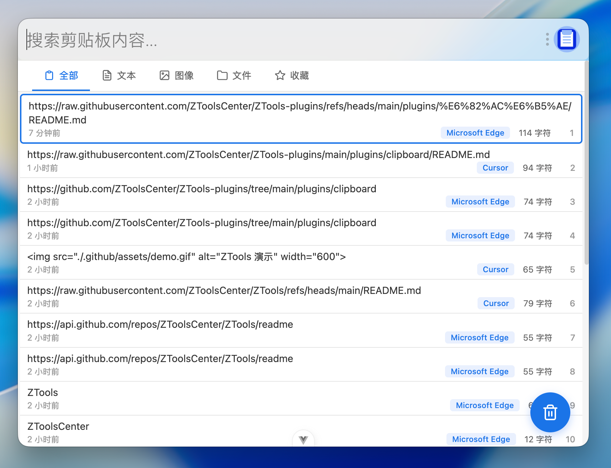

# 剪贴板历史管理 (Clipboard History)

一个功能强大的 ZTools 剪贴板历史管理插件，支持文本、图像、文件的历史记录查看、搜索、收藏等功能。

## 截图



## 功能特性

### 🎯 核心功能

- **多类型支持** - 支持文本、图像、文件三种剪贴板内容类型
- **智能分类** - 提供全部、文本、图像、文件、收藏五个分类标签,快速筛选所需内容
- **实时监听** - 自动监听系统剪贴板变化,实时同步最新内容
- **分页加载** - 支持无限滚动,自动加载更多历史记录

### 🔍 高效查找

- **全文搜索** - 通过搜索框快速过滤剪贴板内容
- **收藏功能** - 右键收藏重要内容(支持文本和图像),并可添加备注
- **来源追踪** - 显示每条记录的来源应用

### ⌨️ 快捷操作

- **键盘导航** - 上下键选择、左右键切换分类、回车键复制
- **双击复制** - 双击任意项目即可快速复制到剪贴板
- **一键清空** - 快速清空所有剪贴板历史记录

### 🎨 界面设计

- **响应式布局** - 界面简洁清晰,信息展示一目了然
- **深色模式** - 自动适配系统深色/浅色主题
- **展开/收起** - 长文本和多文件支持展开查看完整内容

## 安装

1. 将本插件放入 ZTools 的 plugins 目录
2. 在 ZTools 中启用该插件
3. 使用快捷键或搜索打开插件

## 使用说明

### 基本操作

- **查看历史记录** - 打开插件即可查看所有剪贴板历史
- **切换分类** - 点击顶部标签或使用左右方向键切换
- **复制内容** - 双击或选中后按回车键
- **搜索内容** - 在搜索框输入关键词进行过滤

### 高级功能

#### 收藏内容

1. 右键点击文本或图像项目
2. 选择"收藏"选项
3. 可选择添加备注信息
4. 在"收藏"标签中查看收藏的内容

#### 键盘快捷键

| 快捷键 | 功能 |
|--------|------|
| `↑` `↓` | 上下选择剪贴板项目 |
| `←` `→` | 左右切换分类标签 |
| `Enter` | 复制选中项目到剪贴板 |

### 内容类型说明

- **文本** - 显示文本内容、字符数、来源应用
- **图像** - 显示图像预览、分辨率信息
- **文件** - 显示文件列表、文件类型图标、是否存在状态

## 技术栈

- **前端框架** - Vue 3
- **构建工具** - Vite
- **样式** - CSS Variables (支持深色模式)

## 开发

```bash
# 安装依赖
npm install

# 开发模式
npm run dev

# 构建
npm run build
```

## 注意事项

- 收藏功能仅支持文本和图像类型
- 文件类型记录会显示文件是否已被删除
- 长文本默认折叠显示,可点击展开按钮查看完整内容
- 剪贴板历史会持久化存储在本地

## 许可证

本项目仅供个人学习和研究使用。
