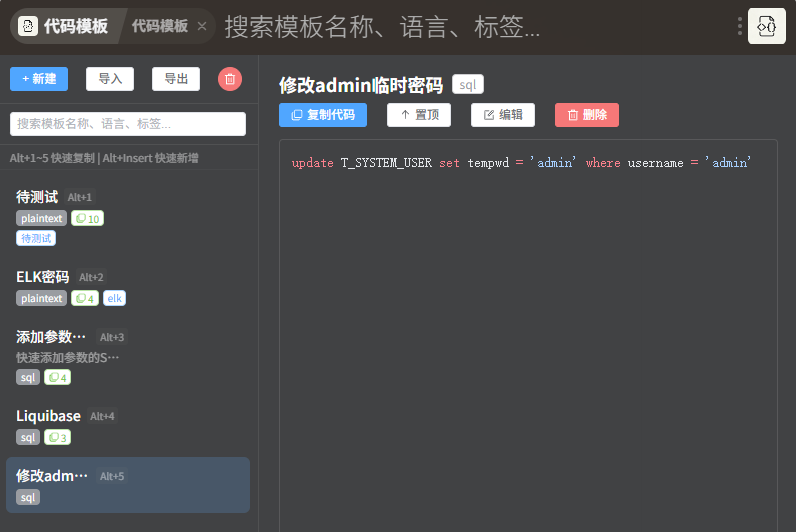

# 代码模板（Code Snippets）

ZTools 插件 —— 保存和管理常用代码模板，支持一键复制、搜索过滤、按使用频率排序、导入导出。



## 更新日志

### v1.2.0

- 新增变量占位符插值：模板支持 `${1}`、`${2:默认值}`，复制时填参自动替换
- 新增模板置顶功能
- 新增直接搜索：在 ZTools 直接输入关键词即可搜索模板

### v1.1.1

- 优化模板列表显示方式：语言和复制次数改为标签形式显示，标题不再被遮挡

### v1.1.0

- 新增快捷键 `Alt+1~5` 快速复制前 5 个模板
- 新增快捷键 `Alt+Insert` 快速新增模板（自动填入剪贴板内容）
- 模板列表显示快捷键提示，搜索框下方显示快捷键帮助栏

## 使用场景

- **刷题/竞赛**：保存常用算法模板（快排、并查集、线段树等），比赛时一键复制
- **日常开发**：存储项目中高频使用的代码片段（接口请求、正则表达式、配置模板等）
- **学习笔记**：按语言或标签整理代码示例，随时查阅和复用
- **团队协作**：通过导入/导出 JSON 文件，与同事共享代码模板库

## 功能介绍

### 模板管理

- **新建模板**：填写名称、描述、选择语言、添加标签，使用代码编辑器编写模板内容
- **编辑模板**：点击模板进入详情页，点击「编辑」按钮修改
- **删除模板**：支持单条删除（带确认弹窗）和一键清空全部
- **详情查看**：选中模板后右侧展示完整代码，支持语法高亮

### 复制与统计

- **一键复制**：列表项 hover 显示快捷复制按钮，详情页也有复制按钮
- **变量占位符**：模板代码中可用 `${1}`、`${2:默认值}` 定义占位符，复制时弹窗填写参数，自动替换生成最终代码
- **使用统计**：自动记录每个模板的复制次数，列表按复制次数降序排列，高频模板排在前面

### 占位符语法

模板代码支持变量占位符，复制时自动弹窗填写、替换为最终代码：

- `${1}`：参数占位符，数字为填写顺序（1、2、3…）
- `${1:默认值}`：带默认值的占位符，弹窗中预填默认值，可修改

示例：

```js
const ${1:变量名} = await axios.${2:get}('${3:/api/user/list}')
```

复制时依次填写「变量名、请求方法、接口路径」，生成最终代码：

```js
const data = await axios.post('/api/user/update')
```

> 仅 `${数字}` / `${数字:默认值}` 会被识别为占位符，JS 模板字符串的 `${变量}` 不受影响。

### 置顶

- 列表项和详情页均可置顶/取消置顶模板
- 置顶模板始终排在最前，独立于使用次数排序

### 搜索与筛选

- **关键词搜索**：顶部搜索框支持按名称、描述、语言、标签、代码内容模糊匹配
- **直接搜索**：选择「搜索代码模板」进入插件，自动按关键词过滤列表
- **自动定位**：进入插件时若关键词只匹配到一个模板，自动选中并复制该模板
- **语言筛选**：支持 JavaScript、TypeScript、Python、Java、C/C++、Go、Rust、HTML、CSS、SQL、JSON、Markdown 等语言，选择后代码编辑器自动高亮

### 标签系统

- 回车添加标签，点击 × 删除，方便对模板进行分类管理
- 列表和详情页均展示标签

### 导入与导出

- **导出**：将所有模板导出为 JSON 文件（开发模式下自动下载，ZTools 环境下调用系统保存对话框）
- **导入**：从 JSON 文件批量导入模板，自动跳过已存在的同 ID 模板

## 界面说明

```
┌─────────────┬──────────────────────────────┐
│  [新建]      │                              │
│  [导入]      │     详情 / 编辑区域           │
│  [导出]      │                              │
│  [清空]      │     展示代码、描述、标签       │
│─────────────│     提供复制、编辑、删除操作     │
│  [搜索框]    │                              │
│─────────────│                              │
│  模板列表项   │                              │
│  主函数-Java  │                              │
│  快排-Python  │                              │
│  ...         │                              │
└─────────────┴──────────────────────────────┘
```

- 左侧为模板列表，每项显示名称、语言、描述、标签和复制次数
- 右侧为内容区域：选中模板后展示详情，点击编辑进入编辑模式
- 列表项 hover 时显示快捷复制和删除按钮

## 触发方式

在 ZTools 中：

- 输入 `代码模板` / `code snippet` / `snippet` / `模板` 打开插件
- 直接输入任意关键词（如 `快排`），选择「搜索代码模板」即可打开插件并直接搜索该关键词
