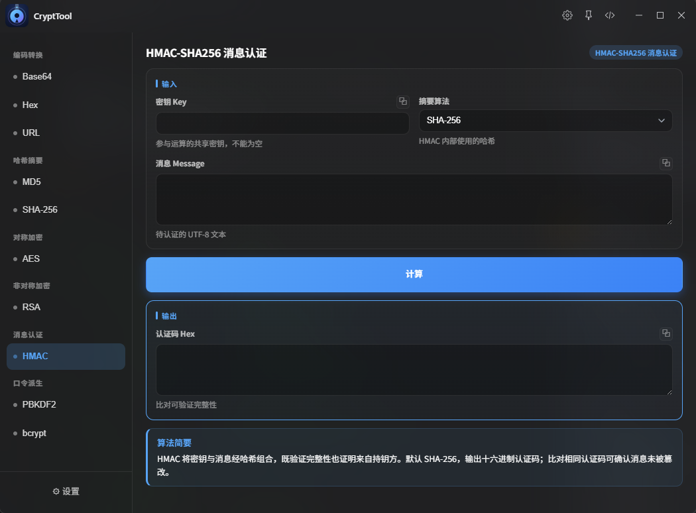
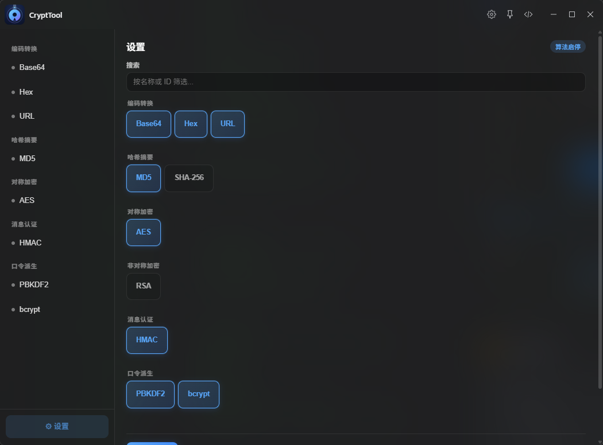

# crypt-tool

> 加解密工具，高颜值，可自定义，UI 和谐统一，带加密算法的简要指引

基于 **React 19 + Vite 6 + TypeScript** 构建的 ZTools 插件，提供 9 种常用编解码与加密算法。

# 为什么选择`crypt-tool`?

1. 现代化界面设计，和ZTools原生设计风格一致，原生软件般体验
2. 支持算法广泛，可自定义界面功能

## ✨ 功能概览

### 友好的交互设计`一目了然`



### 根据自己的需求定制内容



### 后续支持算法

[DEVELOP.md#后续算法计划](DEVELOP.md#后续算法计划)

## 📁 项目结构

```
.
├── public/
│   ├── logo.png                  # 插件图标
│   ├── plugin.json               # 插件配置
│   └── preload/
│       └── services.js           # 向渲染进程注入 crypt 服务
│       └── crypt/                # Node.js crypto 实现
│           ├── encoding.js       #   base64 / hex / url
│           ├── hash.js           #   md5 / sha256
│           ├── aes.js            #   AES-CBC / AES-GCM
│           ├── rsa.js            #   RSA-OAEP 加解密 / 密钥生成
│           └── hmac-pbkdf2.js    #   HMAC 签名验证 / PBKDF2
├── src/
│   ├── main.tsx                  # 入口
│   ├── App.tsx                   # 根组件：加载设置、监听 onPluginEnter
│   ├── shell/                    # 侧边栏 + 算法宿主 + 设置页
│   │   ├── Shell.tsx
│   │   ├── Sidebar.tsx
│   │   ├── AlgorithmHost.tsx
│   │   └── SettingsPage.tsx
│   ├── registry/                 # 算法注册表与分类
│   │   ├── types.ts              # AlgorithmModule / AlgorithmMeta
│   │   ├── categories.ts         # 六大类别定义
│   │   └── algorithms.ts         # 9 个算法 + 筛选帮手
│   ├── config/                   # dbStorage 设置 + 动态功能同步
│   │   ├── settings.ts
│   │   └── features.ts
│   ├── shared/                   # 跨算法复用 UI
│   │   ├── Field.tsx             # 输入/输出字段（text/secret/textarea/select）
│   │   ├── TeachCard.tsx         # 算法说明卡片
│   │   ├── Actions.tsx           # 按钮组
│   │   ├── CopyButton.tsx        # 复制 + toast
│   │   └── crypt-shell.css       # 全部视觉样式
│   ├── algorithms/               # 每种算法的 meta + ui + barrel
│   │   ├── codec.ts              # 编解码辅助（runCodec / showError / showData）
│   │   ├── base64/
│   │   ├── hex/
│   │   ├── url/
│   │   ├── md5/
│   │   ├── sha256/
│   │   ├── aes/
│   │   ├── rsa/
│   │   ├── hmac/
│   │   └── pbkdf2/
│   └── types/crypt.ts            # CryptResult 类型
├── docs/
│   └── superpowers/
│       ├── specs/2026-09-22-crypt-tool-design.md   # 架构设计
│       └── plans/2026-09-22-crypt-tool.md          # 实现计划
└── package.json
```

## 🚀 快速开始

```bash
npm install
npm run dev      # 开发模式，ZTools 自动加载 localhost:5173
npm run build    # 构建到 dist/
npm test         # 运行 vitest 全套测试
```

命令行直达（开发模式下可在 ZTools 搜索框触发）：`base64`、`hex`、`url编码`、`md5`、`sha256`、`aes加密`、`rsa加密`、`hmac`、
`pbkdf2`。

## 🧩 如何新增一种算法

1. **Preload 实现**：在 `public/preload/crypt/` 新增 `<algo>.js`，用 `envelope.js` 的 `ok/fail/tryCrypt` 包裹并暴露
   `{ ok, data/error }` 结果；在 `index.js` 中挂载导出。
2. **类型**：在 `src/env.d.ts` 的 `CryptNamespace` 中追加对应方法签名。
3. **算法模块**：在 `src/algorithms/<algo>/` 下创建 `meta.ts`、`ui.tsx`、`index.ts`，导出 `AlgorithmModule`。
4. **注册**：在 `src/registry/algorithms.ts` 的数组中加入新模块。
5. **同步**：`syncFeatures` 会自动将它注册为直达指令 `alg:<id>`。

详细设计见 `docs/superpowers/specs/2026-09-22-crypt-tool-design.md`。

## 📦 脚本

| 命令                                      | 作用                   |
|-----------------------------------------|----------------------|
| `npm run dev`                           | 启动 Vite 开发服务器        |
| `npm run build`                         | tsc 类型检查 + Vite 生产构建 |
| `npm test`                              | 运行 vitest 单元测试       |
| `npm run build` 成功后会输出到 `dist/`，可直接用于分发 |

## 📄 协议

MIT License
