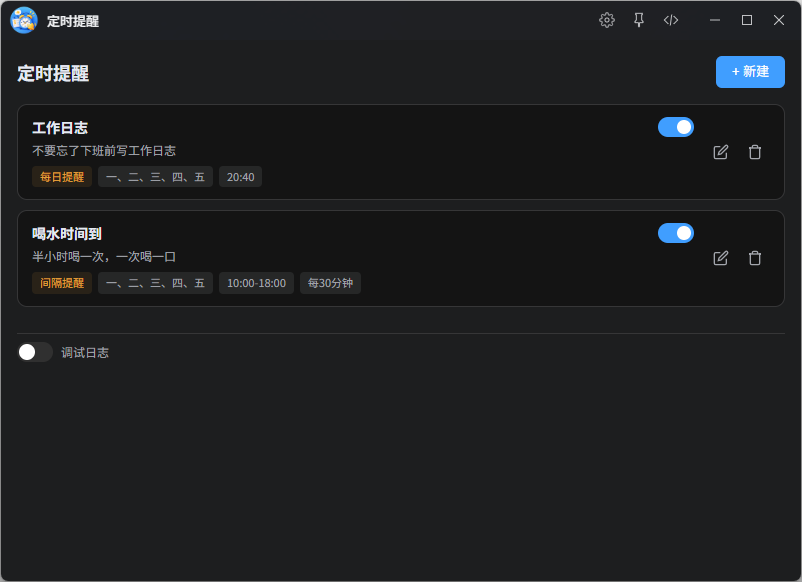

# 定时提醒

> ZTools 插件 - 灵活可靠的定时提醒工具



## 更新日志

### v1.0.1 (2026-08-27)

**修复**
- 修复安装编译包后打开白屏问题

### v1.0.0 (2026-08-27)

**新增**
- 三种提醒模式：间隔提醒、每日定点提醒、一次性定时提醒
- 调度器运行在 preload 层，插件后台也能稳定触发通知
- 支持自定义提醒标题和内容
- 间隔提醒支持多时间段、自定义间隔
- 每日提醒支持选择星期几和具体时间
- 一次性提醒支持选择日期和时间，触发后自动禁用
- 提醒列表支持启用/禁用开关
- 调试日志面板（默认关闭），方便排查问题

**优化**
- 动态调度算法，精确计算下次触发时间，偏差 < 20ms
- 系统通知标题显示任务名，内容显示描述
- 数据持久化存储，随账号同步

---

## 功能

### 三种提醒模式

| 模式 | 说明 | 适用场景 |
|------|------|---------|
| **间隔提醒** | 在指定时间段内，每隔 X 分钟提醒一次 | 久坐提醒、喝水提醒、眼保健操 |
| **每日提醒** | 每天固定时间提醒（可指定星期几） | 起床、吃药、会议提醒 |
| **一次性提醒** | 在指定日期时间触发一次，触发后自动禁用 | 倒计时、临时事项提醒 |

### 后台运行

调度器运行在 ZTools preload 层，插件窗口关闭或隐藏到后台时，定时器依然正常运行，到点自动弹出系统通知。

### 通知格式

- 标题：提醒任务名称
- 内容：提醒描述文字

---

## 使用方式

### 触发

在 ZTools 搜索框输入以下指令之一：

- `提醒`
- `定时提醒`

### 新建提醒

1. 点击 **+ 新建** 按钮
2. 选择提醒类型（间隔 / 每日 / 一次性）
3. 填写提醒标题和内容
4. 配置具体时间参数
5. 点击 **保存**

### 管理提醒

- **开关**：列表右侧开关可随时启用/禁用提醒
- **编辑**：点击编辑图标修改提醒参数
- **删除**：点击删除图标移除提醒

---

## 开发

### 技术栈

- Vue 3 + TypeScript
- Element Plus UI
- Vite 构建
- ZTools API

### 本地开发

```bash
# 安装依赖
npm install

# 启动开发模式
npm run dev

# 构建生产版本
npm run build
```

构建产物在 `dist/` 目录，复制到 ZTools 插件目录即可使用。

---

## 常见问题

### 后台不提醒？

确认 ZTools 系统通知权限已开启。调度器运行在 preload 层，窗口隐藏后仍会触发。

### 通知不显示？

检查系统通知权限是否允许 ZTools 发送通知。

### 数据会丢失吗？

提醒数据存储在 ZTools 云端，开启数据同步后不会丢失。

---

## 许可

MIT License