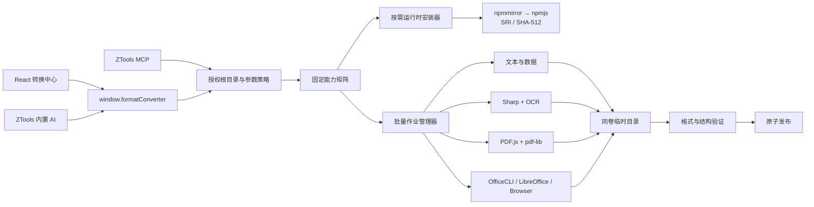

# 架构说明

## 分层

renderer 只使用结构化业务方法，不接触 `fs`、`child_process`、二进制路径、下载 URL、环境变量或任意命令。preload 及第三方 Node 依赖保持可读目录结构。

## 授权模型

- UI 文件选择产生 12 小时短期输入 grant。
- 输出目录选择产生短期输出 grant，并把目录保存为 MCP 授权根目录。
- MCP 只能访问已授权根目录内的绝对路径；未授权时返回 `WORKSPACE_APPROVAL_REQUIRED`。
- MCP 不能安装运行时；安装必须由用户在插件 UI 中确认。
- 输入使用 `lstat + realpath + magic bytes` 检查，拒绝符号链接、空文件、扩展名伪装和超限文件。
- 输出先写入目标目录同卷的隐藏临时目录，验证后 rename；默认自动重命名，不覆盖源文件。

## 转换质量

- `visual`：页面外观优先，Office 反向转换可能使用整页图片。
- `editable`：文本和表格结构优先，复杂版式可能变化。
- `extract`：只提取正文、表格或图片。

转换能力由固定路由表生成。缺少 OfficeCLI、浏览器或 LibreOffice 时路线不可执行；不会回退到未声明的外部程序。

## 引擎边界

- OfficeCLI：OOXML 读取、生成、校验、HTML/截图和可用时的 PDF exporter。
- LibreOffice：可选 Office → PDF 后端，使用独立 profile 与 `shell:false`。
- Chrome/Edge/Chromium：OfficeCLI HTML 打印和截图依赖。
- PDF.js：禁用 PDF JavaScript eval，限制页数。
- Sharp：按当前平台安装，限制解码像素数，输出格式白名单。
- Tesseract.js：用户确认后从 npm 镜像按需安装运行时及 `eng` / `chi_sim` 模型，识别阶段离线运行。

所有外部进程使用固定 argv、超时、输出上限和取消信号。macOS/Linux 使用独立进程组终止；Windows 先终止直接子进程，后续 sidecar 版本应使用 Job Object 保证进程树回收。

## 跨平台发布

ZTools 上游会把未设置单平台限制的插件归入通用构建。插件包不携带重型引擎：`generate-runtime-manifest.mjs` 从根锁文件计算 Sharp、PDF、OCR、Excel 四个依赖闭包，记录不可变 URL、版本、SRI、OS、CPU 与 libc 约束。运行时逐包校验并安装到 ZTools 数据目录，Sharp 只选择当前系统载荷；PDF.js 在宿主中复用 Chromium Canvas，Node 集成测试才使用开发依赖中的 `@napi-rs/canvas`。

`verify-dist.mjs` 同时执行以下发布门禁：

- 插件展开体积必须小于 15 MB。
- `dist/preload/node_modules` 只允许基础 `iconv-lite`，不得混入 Sharp、PDF.js、Tesseract.js 或 ExcelJS。
- Preload 源码与发布副本逐文件一致，运行时清单必须由当前 lockfile 可重复生成。
