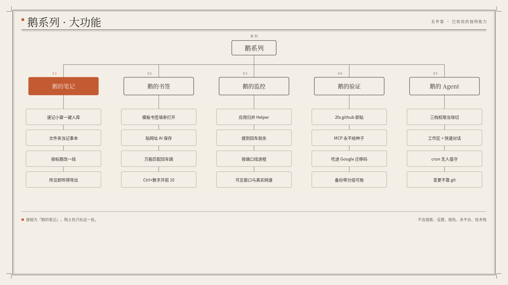

# 鹅的笔记

把本机 Markdown 文件夹和独立速记小窗收成一本可被助手读写的笔记，而不是再做一个云端 Notion。

## 大功能

- **速记小窗入库**：独立「鹅的小窗」常驻，写完一键进主笔记，不打断当前窗口。
- **文件夹当记事本**：挂上本机目录就能当一本笔记，卸挂载不删磁盘上的文件。
- **按标题改一段**：助手按 Markdown 读写；指定标题只改那一段，删笔记进回收站。
- **按你看见的样子导出**：PDF / Word / 图按所见出，中文、图表、公式、本地图片都进，不是倒源码。
- **锁定页与里程碑**：锁定后助手不能删；历史有上限，淘汰时留住你标过的里程碑。

## 系列

## 同系列

- [鹅的笔记](https://github.com/eachann1024/goose-notes)
- [鹅的书签](https://github.com/eachann1024/goose-mark)
- [鹅的监控](https://github.com/eachann1024/goose-monitor)
- [鹅的验证](https://github.com/eachann1024/goose-2fa)
- [鹅的 Agent](https://github.com/eachann1024/eachann1024)

## 不做什么

不把笔记默认送到别人的云。不把「搜索 / 暗色 / 多平台」当卖点。

开发说明见 [DEVELOP.md](DEVELOP.md)。
