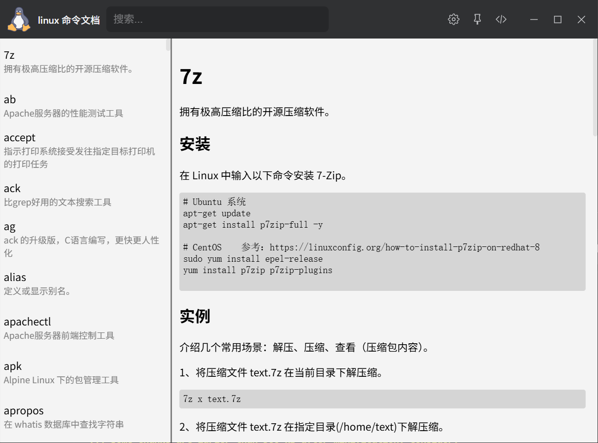
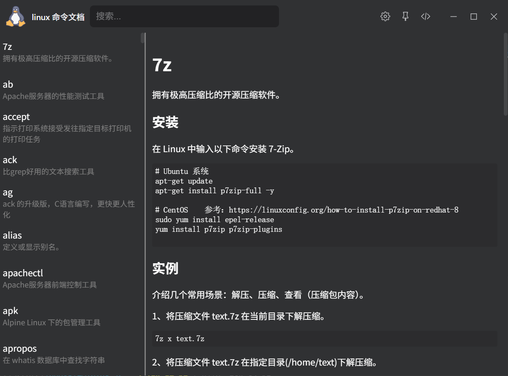

# linux-cmd-tool-plugin

> 在 ZTools 中快速查询 Linux 命令的用法速查表 —— 搜索、浏览、明暗主题一应俱全。

[](https://vuejs.org/)
[](https://www.typescriptlang.org/)
[](https://vitejs.dev/)
[](./LICENSE)

---

## ✨ 功能特性

- 🔍 **命令搜索** —— 按命令名 / 描述快速过滤，输入即搜
- 📜 **虚拟列表** —— 命令数量较多也能流畅滚动，不卡顿
- 📖 **Markdown 渲染** —— 命令文档以 Markdown 原样呈现，含代码块、表格、参数说明
- 🌓 **明暗主题** —— 跟随 ZTools / 系统主题，也支持手动切换
- 📦 **数据自动同步** —— 命令数据来自 [jaywcjlove/linux-command](https://github.com/jaywcjlove/linux-command)，安装依赖时自动拉取
- ⚡ **Vue 3 + TypeScript + Vite** —— 现代化的开发体验与构建产物

## 📸 截图


| 亮色 | 暗色 |
| --- | --- |
|  |  |

## 🚀 安装

### 从插件市场安装

在 ZTools 插件市场中搜索 **Linux 命令文档** 并安装。

### 手动安装

下载 Release 中的插件包，在 ZTools 中选择「导入插件」即可。

## 🛠️ 本地开发

### 环境要求

- Node.js >= 18
- npm / pnpm / yarn（示例使用 npm）

### 快速开始

```bash
# 1. 克隆仓库
git clone https://github.com/ltxhhz/linux-cmd-tools-plugin.git
cd linux-cmd-tools-plugin

# 2. 安装依赖
#    postinstall 会自动把 linux-command 包中的 markdown 文档
#    复制到项目内的命令目录，仓库本身不包含这些 .md 文件
pnpm install

# 3. 启动开发模式
pnpm run dev

# 4. 构建
pnpm run build
```


## 🧱 技术栈

| 方向 | 选型 |
| --- | --- |
| UI 框架 | Vue 3（Composition API + `<script setup>`） |
| 语言 | TypeScript |
| 构建工具 | Vite |
| Markdown | [unplugin-vue-markdown/vite](https://github.com/unplugin/unplugin-vue-markdown) |
| 长列表 | 虚拟列表（按需渲染可视区域） |
| 数据源 | [jaywcjlove/linux-command](https://github.com/jaywcjlove/linux-command) |

## 📚 数据来源与同步机制

命令内容全部来自开源项目 [**jaywcjlove/linux-command**](https://github.com/jaywcjlove/linux-command)，以 Markdown 形式提供。

本插件通过 npm 依赖 + `postinstall` 脚本的方式同步数据：

1. `npm install` 时，npm 会安装 `linux-command` 包；
2. `postinstall` 钩子执行 `scripts/copy.mjs`；
3. 脚本将包内的 `.md` 文档复制到 `src/command/`；
4. Vite 通过 `unplugin-vue-markdown/vite` 在构建时把它们解析为可渲染内容。

因此：

- 本仓库 **不包含** 任何命令 Markdown 文件；
- 命令内容的版权与更新维护归 [jaywcjlove/linux-command](https://github.com/jaywcjlove/linux-command) 所有；
- 若要更新命令内容，升级 `linux-command` 依赖版本后重新运行 `npm install` 即可。

## 🌓 主题

- 默认跟随 ZTools / 系统主题自动切换；
- 可在插件内手动切换亮色 / 暗色；

## 🤝 贡献

欢迎提交 Issue 和 PR！

1. Fork 本仓库
2. 新建分支：`git checkout -b feat/your-feature`
3. 提交改动：`git commit -m "feat: xxx"`
4. 推送分支：`git push origin feat/your-feature`
5. 发起 Pull Request

## 📄 License

本项目基于 [MIT](./LICENSE) 协议开源。

命令数据来自 [jaywcjlove/linux-command](https://github.com/jaywcjlove/linux-command)，同样以 MIT 协议发布，版权归原作者所有。

## 🙏 致谢

- [jaywcjlove/linux-command](https://github.com/jaywcjlove/linux-command) —— 提供权威且持续维护的 Linux 命令速查数据
- [unplugin-vue-markdown](https://github.com/unplugin/unplugin-vue-markdown) —— Markdown 解析支持
- [Vue](https://vuejs.org/) / [Vite](https://vitejs.dev/) / [TypeScript](https://www.typescriptlang.org/) 社区

---

如果这个插件对你有帮助，欢迎点个 ⭐ Star 支持一下！