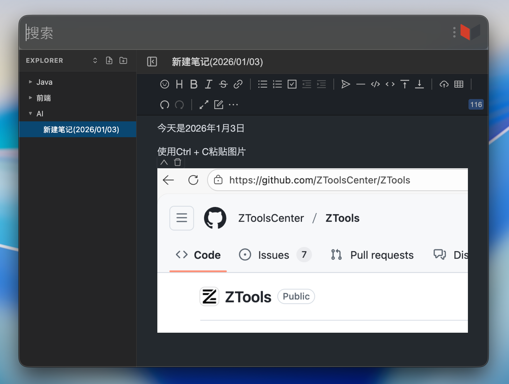

# Markdown 笔记编辑器 (Markdown Notes)

一个功能强大的 ZTools Markdown 笔记编辑器插件，基于 Vditor 编辑器，支持文件树管理、实时预览、导出等功能。

## 截图



## 功能特性

### ✍️ 编辑功能

- **所见即所得** - 基于 Vditor 编辑器，支持实时预览
- **Markdown 语法** - 完整支持标准 Markdown 语法
- **图片粘贴** - 支持 Ctrl+C 直接粘贴图片
- **自动保存** - 内容自动保存，防止数据丢失
- **代码高亮** - 支持多种编程语言的代码高亮

### 📁 文件管理

- **文件树结构** - 左侧文件树，支持文件夹和文件的层级管理
- **拖拽排序** - 支持拖拽文件/文件夹进行移动和排序
- **快速创建** - 一键创建新文件或文件夹
- **重命名** - 支持文件和文件夹重命名
- **复制文件** - 快速复制笔记内容
- **删除管理** - 删除不需要的文件或文件夹

### 💾 导出功能

- **导出 Markdown** - 将笔记导出为 .md 文件
- **导出 HTML** - 将笔记导出为独立的 HTML 文件，可直接在浏览器中查看

### 🎨 界面设计

- **深色模式** - 自动适配系统深色/浅色主题
- **侧边栏切换** - 可隐藏/显示文件树，专注编辑
- **响应式布局** - 界面简洁清晰，操作流畅
- **记忆功能** - 自动记住上次打开的笔记

## 安装

1. 将本插件放入 ZTools 的 plugins 目录
2. 在 ZTools 中启用该插件
3. 使用快捷键或搜索 "Markdown" 打开插件

## 使用说明

### 基本操作

#### 文件管理

- **创建文件** - 点击文件树顶部的"新建文件"按钮
- **创建文件夹** - 点击文件树顶部的"新建文件夹"按钮
- **选择文件** - 点击文件树中的文件即可打开编辑
- **拖拽移动** - 按住文件/文件夹拖动到目标位置
- **隐藏侧边栏** - 点击编辑器顶部的侧边栏切换按钮

#### 编辑笔记

- **编辑标题** - 在顶部标题栏直接修改文件名
- **编辑内容** - 在编辑器中输入 Markdown 内容
- **粘贴图片** - 使用 Ctrl+C 复制图片后，在编辑器中粘贴
- **自动保存** - 编辑内容会自动保存，无需手动操作

### 高级功能

#### 右键菜单

在文件树中右键点击文件或文件夹，可以使用以下功能：

- **重命名** - 重命名文件或文件夹
- **复制** - 复制文件内容（仅文件）
- **删除** - 删除文件或文件夹
- **导出 Markdown** - 导出为 .md 文件（仅文件）
- **导出 HTML** - 导出为 .html 文件（仅文件）

#### 文件夹管理

- 文件和文件夹支持无限层级嵌套
- 可以将文件拖入文件夹进行归类
- 删除文件夹会同时删除其中的所有文件
- 支持文件夹展开/折叠

#### 导出说明

- **导出 Markdown** - 导出纯文本 .md 文件，可在任何 Markdown 编辑器中打开
- **导出 HTML** - 导出包含样式的独立 HTML 文件，可直接在浏览器中查看渲染效果

## 技术栈

- **前端框架** - Vue 3
- **编辑器** - Vditor 3.10.7
- **构建工具** - Vite
- **样式** - CSS Variables (支持深色模式)
- **存储** - 本地持久化存储（使用 ZTools DB）

## 开发

```bash
# 安装依赖
npm install

# 开发模式
npm run dev

# 构建
npm run build
```

## 数据存储

- 所有笔记内容和文件树结构都存储在本地
- 使用 ZTools 提供的数据库进行持久化
- 数据不会上传到云端，完全本地化

## 注意事项

- 编辑器会自动保存内容，默认延迟 1 秒
- 删除文件夹会递归删除所有子文件，请谨慎操作
- 粘贴图片时，图片会以 Base64 格式嵌入 Markdown
- 导出 HTML 时会包含 Vditor 样式，确保渲染效果一致

## 快捷键

编辑器支持 Vditor 的所有快捷键，常用快捷键包括：

- `Ctrl+B` - 加粗
- `Ctrl+I` - 斜体
- `Ctrl+K` - 插入链接
- `Ctrl+Shift+S` - 删除线
- `Ctrl+E` - 行内代码
- `Ctrl+Shift+C` - 代码块

更多快捷键请参考 [Vditor 官方文档](https://github.com/Vanessa219/vditor)

## 许可证

本项目仅供个人学习和研究使用。
