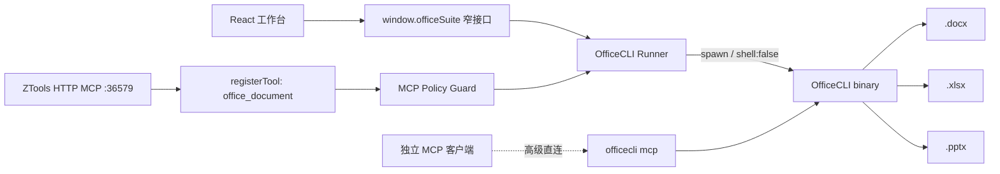

# 架构说明

## 目标

同一套 Office 文档能力同时服务于 ZTools UI、ZTools HTTP MCP 和独立 stdio MCP 客户端；本地进程权限只存在于可审核的 preload 层。



## 分层

### UI

React 只负责文件选择、命令构建、状态显示和结果可视化。快捷操作使用 argv 数组，避免文件名中的空格、引号、反斜杠和 `$` 被再次解析。

### Preload bridge

`preload/services.cjs` 只暴露业务方法，不把 `fs`、`child_process` 或 runner 对象交给页面。返回值固定为可序列化 envelope：

```js
{ ok: true, data: value }
{ ok: false, error: { code, message, details? } }
```

### Runner

`preload/officecli-runner.cjs` 负责：

- 发现并验证可执行文件。
- 将字符串安全分词，或直接接收 argv。
- 命令 allowlist、参数数量和长度校验。
- 固定 `shell:false`，设置超时与 stdout/stderr 上限。
- 解析 `--json` 输出。
- 探测 OfficeCLI 原生 MCP 的 `initialize` 与 `tools/list`。

### ZTools MCP tool

`plugin.json.tools.office_document` 是宿主发现契约；preload 顶层立即注册同名 handler。MCP 可能在 UI 从未打开时后台唤起插件，因此该 handler 不读取 React 状态。`backgroundRunning: true` 避免隐藏 WebContents 节流影响子进程事件和超时。

## 运行时策略

首版使用系统安装的 OfficeCLI，不重新分发二进制。后续若提供内置 RuntimeManager，应满足：

1. 锁定精确版本和平台资产。
2. 下载 `SHA256SUMS` 并 fail-closed 校验。
3. 写入插件数据目录的版本化子目录。
4. 校验成功后原子替换，保留上一个已验证版本回滚。
5. 随分发物提供 Apache-2.0 `LICENSE`、`NOTICE` 和第三方声明。

## 写操作一致性

- 三个以上的同文件修改优先使用 OfficeCLI 原子 `batch`。
- UI 默认禁用自动 resident；需要长会话时显式 `open`，完成后 `save` / `close`。
- 生产级批处理应先复制到临时输出，完成 `validate`、`view issues` 和视觉审计后再交付。
- 同一文件的并发写应在未来版本增加路径级串行队列；首版由 UI 单任务 busy 状态和 OfficeCLI 文件锁共同防护。

## 威胁模型

受信任边界内包括当前 OS 用户、ZTools preload 和指定 OfficeCLI 二进制。网页页面、MCP 请求参数和文档内容均视为不可信输入。

主要控制：

- 不调用 shell。
- 不允许 MCP 覆盖 binary path / cwd / env。
- 禁止 OfficeCLI 安装、升级、插件、skill 安装和 MCP 配置管理命令进入通用文档 runner。
- MCP Key 使用 Authorization header，不放 query string。
- 对超时和输出上限 fail closed。

ZTools 3.0.1 的 MCP 后端实际监听 `0.0.0.0`；启用它意味着局域网可达性取决于防火墙和 API Key。该风险属于宿主边界，插件仍通过收窄命令面降低影响。

首版没有目录级授权列表：持有有效 Key 的调用方仍可操作当前 OS 用户可访问的绝对路径 Office 文件。后续版本应把用户选择的工作区根目录持久化到插件存储，并以 realpath + symlink 检查强制执行。
