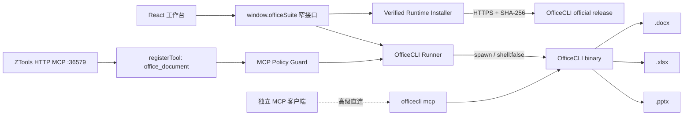

# 架构说明

## 目标

同一套 Office 文档能力同时服务于 ZTools UI、ZTools HTTP MCP 和独立 stdio MCP 客户端；本地进程权限只存在于可审核的 preload 层。



## 分层

### UI

React 只负责文件选择、命令构建、状态显示和结果可视化。快捷操作使用 argv 数组，避免文件名中的空格、引号、反斜杠和 `$` 被再次解析。

AI 助手通过 `window.ztools.allAiModels()` 读取宿主已配置的模型，并由 `window.ztools.ai()` 发起请求，因此提供商凭据始终留在 ZTools。文件作为当前对话上下文保留在 AI 页，不因选择文件自动切换到格式工作台。输入区内的权限菜单提供三种模式：

- **只读**：只允许读取、检查和预览。
- **本次允许修改**：仅下一次请求可写，完成或失败后恢复只读。
- **始终允许修改**：当前插件会话持续可写，关闭或重新加载插件后失效。

写入授权只控制内置 AI 发起的工具调用，不改变外部 ZTools MCP 客户端的权限边界。AI 执行中的命令以紧凑结果区展示，预览图片直接渲染，不要求用户从临时路径自行打开。

### Preload bridge

`preload/services.cjs` 只暴露业务方法，不把 `fs`、`child_process` 或 runner 对象交给页面。返回值固定为可序列化 envelope：

```js
{ ok: true, data: value }
{ ok: false, error: { code, message, details? } }
```

### Runner

`preload/officecli-runner.cjs` 负责：

- 发现并验证可执行文件。
- 将字符串安全分词，或直接接收 argv。
- 命令 allowlist、参数数量和长度校验。
- 固定 `shell:false`，设置超时与 stdout/stderr 上限。
- 解析 `--json` 输出。
- 探测 OfficeCLI 原生 MCP 的 `initialize` 与 `tools/list`。

### Runtime installer

`preload/officecli-installer.cjs` 提供无参数的一键安装能力。平台和架构由 Node 运行时决定，下载地址、资产名、安装目录均由插件内部生成，renderer 无法传入 URL、文件路径或命令。版本、程序资产和校验清单均按 `d.officecli.ai` 国内镜像 → GitHub 的固定顺序获取。安装器只接受版本化的 OfficeCLI 官方资产，要求 `SHA256SUMS` 精确匹配，并在临时文件通过 `--version` 自检后原子替换目标文件。所有进程调用保持 `shell:false`。

版本检测在 UI 就绪后延迟执行，并以 24 小时为周期刷新；网络失败不会影响文档能力。renderer 只能调用无参数的 `checkOfficeCliUpdate()` 与 `updateOfficeCli()`。更新目标来自 runner 已验证的当前二进制路径，不接受页面传参；检测只产生提示，替换必须由用户显式点击。

### ZTools MCP tool

`plugin.json.tools.office_document` 是宿主发现契约；preload 顶层立即注册同名 handler。MCP 可能在 UI 从未打开时后台唤起插件，因此该 handler 不读取 React 状态。`backgroundRunning: true` 避免隐藏 WebContents 节流影响子进程事件和超时。

## 运行时策略

插件优先发现用户已经安装的 OfficeCLI；缺失时可按需安装到 `~/.local/bin`（macOS/Linux）或 `%LOCALAPPDATA%\OfficeCLI`（Windows）。安装是显式用户操作，不在后台静默触发。插件本身不重新分发 OfficeCLI，OfficeCLI 的 Apache-2.0 来源与许可在第三方声明中列明。

## 写操作一致性

- 三个以上的同文件修改优先使用 OfficeCLI 原子 `batch`。
- UI 默认禁用自动 resident；需要长会话时显式 `open`，完成后 `save` / `close`。
- 生产级批处理应先复制到临时输出，完成 `validate`、`view issues` 和视觉审计后再交付。
- 同一文件的并发写应在未来版本增加路径级串行队列；当前版本由 UI 单任务 busy 状态和 OfficeCLI 文件锁共同防护。

## 威胁模型

受信任边界内包括当前 OS 用户、ZTools preload 和指定 OfficeCLI 二进制。网页页面、MCP 请求参数和文档内容均视为不可信输入。

主要控制：

- 不调用 shell。
- 不允许 MCP 覆盖 binary path / cwd / env。
- 禁止 OfficeCLI 安装、升级、插件、skill 安装和 MCP 配置管理命令进入通用文档 runner。
- MCP Key 使用 Authorization header，不放 query string。
- 对超时和输出上限 fail closed。

ZTools 3.0.1 的 MCP 后端实际监听 `0.0.0.0`；启用它意味着局域网可达性取决于防火墙和 API Key。该风险属于宿主边界，插件仍通过收窄命令面降低影响。

当前版本没有目录级授权列表：持有有效 Key 的调用方仍可操作当前 OS 用户可访问的绝对路径 Office 文件。后续版本应把用户选择的工作区根目录持久化到插件存储，并以 realpath + symlink 检查强制执行。
