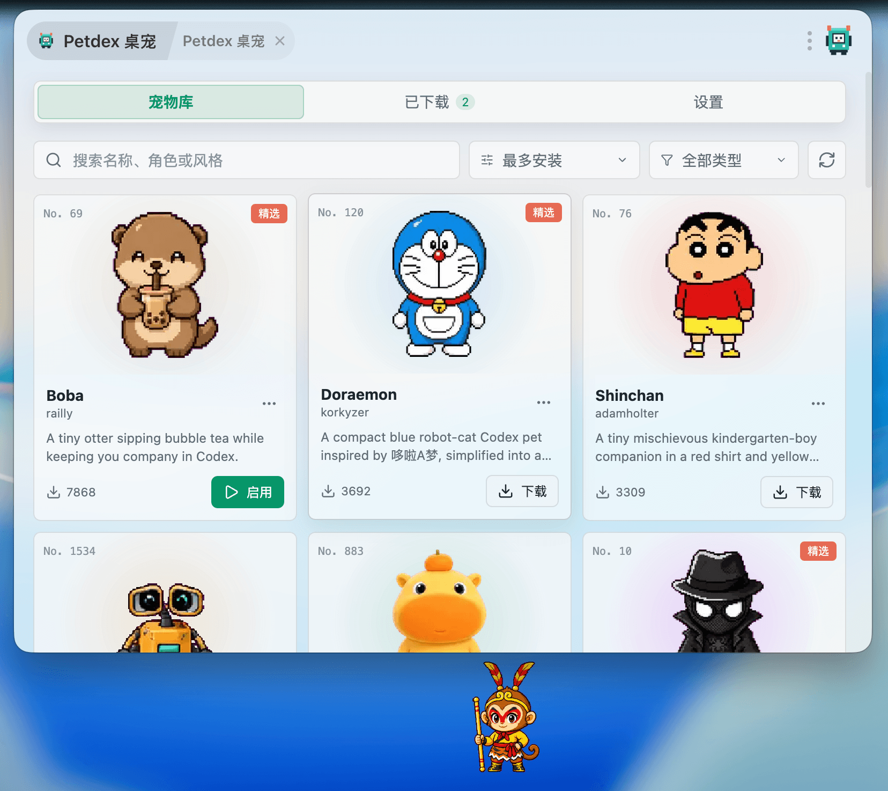

# Petdex 桌宠

基于 Petdex 公开目录的 ZTools 桌宠插件。插件提供宠物搜索、分页浏览、安全下载、本地安装、单宠物启用、透明置顶窗口、拖动、位置恢复和点击换动作。

## 界面预览



## 开发

```bash
pnpm install
pnpm dev
```

开发入口为 `http://127.0.0.1:15180`，通过 ZTools 设置导入 `public/plugin.json`。

## 构建与验证

```bash
pnpm test
pnpm build
node --check public/preload/services.js
node --check public/pet.js
```

构建产物位于 `dist/`。
