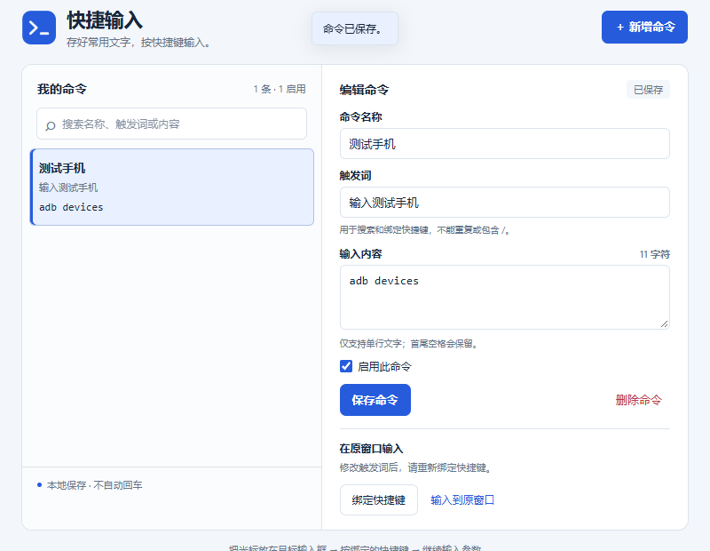

# ZTools 快捷输入

给自己保存的命令或单行文字绑定快捷键，向原先聚焦的应用模拟键盘输入。首次打开列表为空，没有预置命令。首尾空格会保留，不自动按 Enter。

插件 ID：`quick-input`。开发阶段旧 ID `ztools-quick-input` 的配置不会自动迁移到新 ID。



图中的命令由演示时手动添加，首次安装不会包含这些命令。

## 安装和使用

1. 将 `artifacts/quick-input-1.0.2.zip` 拖到 ZTools 搜索框，在匹配结果中选择「安装插件」，完成安装。
2. 在 ZTools 搜索 `快捷输入`，打开管理界面。
3. 填写命令名称、触发词和输入内容，点击「保存命令」。例如：名称 `连接手机`，触发词 `输入连接手机`，内容 `adb connect `（末尾有一个空格）。
4. 点击「绑定快捷键」，进入 ZTools 快捷键设置，为刚保存的触发词设置组合键。若设置页要求手动选择目标，请选择本插件对应的指令。
5. 回到终端或其他应用，点入目标输入框，再按刚绑定的快捷键。文字输入后，可继续补 IP 等参数，再自己按 Enter。

也可以在 ZTools 输入完整的触发词，选择对应指令输入（精确匹配，不区分大小写）。管理界面的「输入到原窗口」使用同一输入能力。输入框应位于打开 ZTools 之前聚焦的应用中；请在 ZTools 主窗口使用本插件，宿主的分离窗口不支持此输入 API。

1.0.2 起，单条输入命令使用匹配型指令，不会逐条加入 ZTools 的「最近使用」列表；「快捷输入」管理入口仍可保留。升级前已有的 `adb`、`pwd` 等历史条目，请右键选择「从使用记录删除」清理一次，命令配置和快捷键绑定会保留。

修改输入内容后直接保存即可。修改**触发词**后，请重新绑定快捷键。停用会移除对应搜索指令，重新启用并保存后可再次使用。删除命令后，已绑定的快捷键需要在 ZTools 设置里自行删除。

触发词需要唯一，不能包含 `/` 或使用管理入口保留词。输入内容仅支持单行文字，不接受换行、Tab 等控制字符。

## 本地开发

运行环境：Node.js 18 或更新版本。插件和构建不需要 npm 依赖。

```powershell
npm test       # 核心逻辑、快捷键启动路由和构建产物检查
npm run dev    # 浏览器界面预览，地址 http://127.0.0.1:4173
npm run build  # 输出 dist/plugin.json 及运行文件
npm run package # Windows：构建并生成可安装的 ZIP 包
```

浏览器预览的配置保存在浏览器本地，与 ZTools 中的配置相互独立。模拟输入和快捷键设置需要在 ZTools 中使用。

若使用开发模式，进入 ZTools 的开发项目入口，导入 `dist/plugin.json` 并安装该开发项目。导入项目与安装项目是两个步骤。修改源码后重新构建，再刷新开发插件。

可选浏览器检查：`npm run test:ui`。它需要环境提供 `playwright` 包和 Microsoft Edge；本次开发使用了环境内置的 Playwright。检查会隔离浏览器存储，并产生界面截图到 `artifacts/`。

## 实现与验证范围

- `commands.js`：配置校验、本地存储、动态功能同步和输入；兼容 ZTools 3.2.0 的对象型注册和存储错误返回值。
- `preload.js`：按启动功能 code 直接输入，或打开管理界面。
- `app.js` / `index.html` / `styles.css`：添加、编辑、搜索、启停、删除命令，以及快捷键设置入口。

已验证配置持久化、空白首次启动、字符串和空格原样传递、注册失败回退、快捷键启动路由、浏览器操作和安装包内容。已静态核对本机 ZTools 3.2.0 的相关宿主实现。输入结束后退出本次插件调用，支持连续使用同一快捷键；后台触发与焦点等待避免输入焦点被主窗口抢占。使用者已在本机 ZTools 确认连续快捷键输入及「最近使用」列表优化测试通过。截图来自浏览器界面预览。

本插件按 MIT 协议开源，见 [LICENSE](LICENSE)。

官方参考：[第一个插件](https://docs.z-tools.top/first-plugin.html)、[插件 API](https://docs.z-tools.top/plugin-api.html)、[插件配置](https://docs.z-tools.top/plugin-json.html)。
