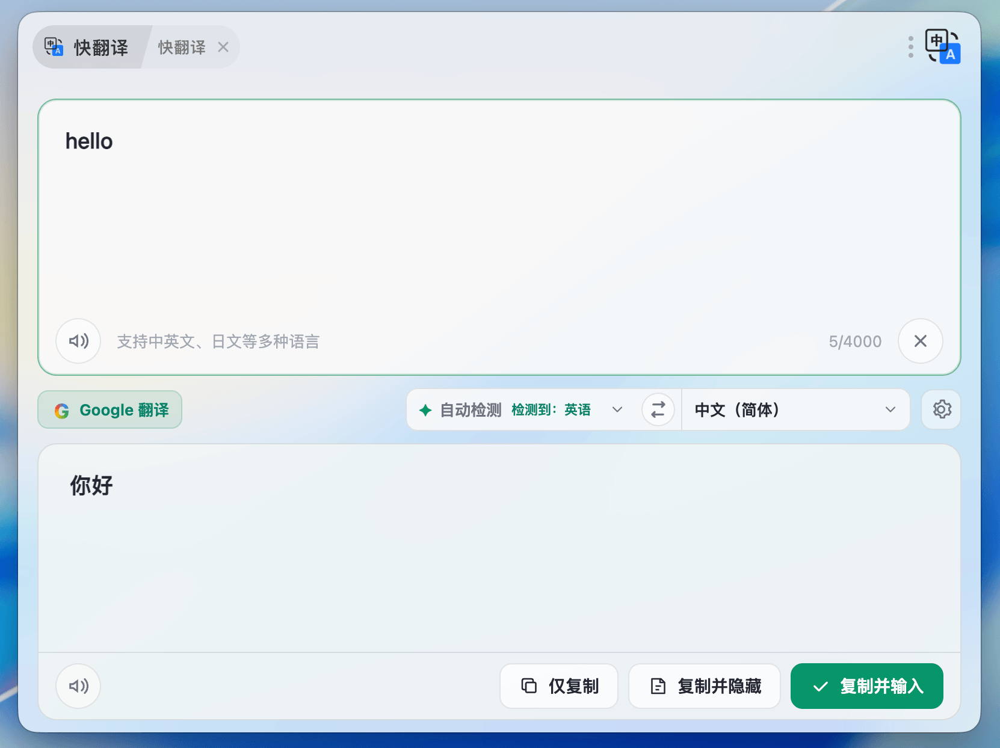
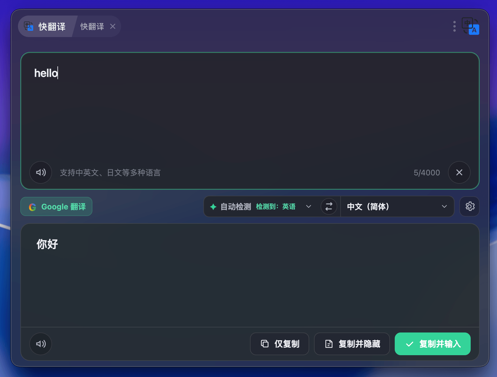

# 快翻译

使用 ZTools 服务端代理的 Google Cloud Translation 和 Cloud Text-to-Speech WaveNet 的翻译插件，界面采用透明材质和主题色适配。

## 界面

### 浅色主题



### 深色主题



## 使用

文本翻译和 WaveNet 朗读都需要先登录 ZTools 账号。插件会通过 ZTools 主程序获取短期鉴权令牌，再请求 ZTools 服务端接口。请求会显式携带 `engine: "google"`，为后续扩展其他引擎保留协议字段。

官方账号凭据、Google Translation API Key 和 Text-to-Speech API Key 都不会暴露给插件。升级后插件会自动删除早期版本保存在本地配置中的 Google API Key 字段。

## 开发

```bash
npm install
npm run dev
npm run build
```

构建后，`dist/` 是可安装的插件目录，包含页面、`preload.js`、`plugin.json` 和 logo。
