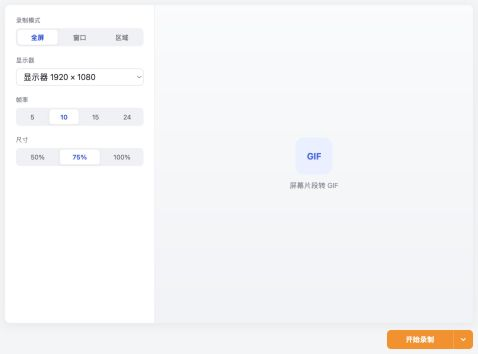

# 截图生成 GIF

ZTools 插件，把屏幕、窗口或自定义区域录制成 GIF 动图。



## 功能

- 全屏录制、窗口录制、鼠标框选区域录制
- 可配置 FPS（5/10/15/24）和输出尺寸（50%/75%/100%）
- 支持手动停止或定时自动停止
- 录制完成后自动调用内置 FFmpeg 转成 GIF
- 支持预览、保存、复制到剪贴板、在文件夹中显示

## 结构

```text
src/
  GifRecorder/           主界面
public/
  plugin.json            插件配置
  preload/services.js    文件读写、子窗口服务
  region.html            区域框选窗口
  controls.html          录制停止控制条
dist/                     Vite 构建后的完整插件目录
```

## 开发

```bash
npm install
npm run dev
```

构建生产版本：

```bash
npm run build
```

## 运行与发布

`public/` 中保存插件清单、Logo、Preload 和辅助窗口。Vite 构建时会将这些文件原样复制到 `dist/`，并把 React 页面一并编译到该目录。

- 开发模式：必须先保持 `npm run dev` 运行，否则 ZTools 会按 `development.main` 加载 `http://localhost:5173` 失败，插件显示空白。
- 本地安装：执行 `npm run build` 后，将 `dist/` 目录内容作为插件根目录导入 ZTools；压缩时不要在压缩包根目录额外包一层 `dist`。
- 仓库发布：保持 Git 工作区干净，在项目根目录运行 `ztools publish`。中心仓库会重新安装依赖、执行构建并生成正式 ZIP。
- 如果已经以“开发项目”方式安装，正式版本建议先在开发者工具中移除或卸载开发模式安装，避免重复入口。

## 使用

1. 在 ZTools 中触发 `截图生成GIF`
2. 选择录制模式和帧率、尺寸
3. 点击开始，3 秒后隐藏主窗口并开始录制
4. 点击顶部停止条，或选择自动停止时长
5. 录制完成后自动转换为 GIF，保存或复制结果
