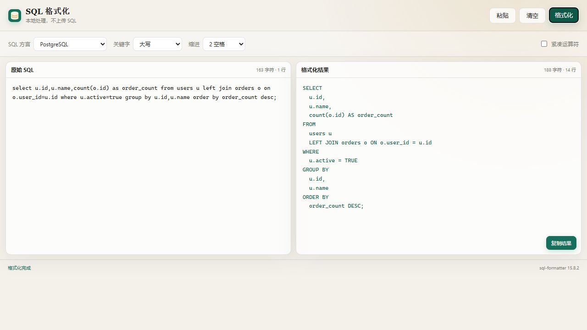

# ZTools SQL 格式化插件

适配 ZTools 3.1.0 的离线 SQL 格式化插件。格式化在本地完成，不上传 SQL。



## 功能

- 支持 Standard SQL、MySQL、PostgreSQL、SQL Server、Oracle、SQLite、BigQuery、Snowflake 等 19 种方言
- 关键字大写、小写或保持原样
- 2 / 4 空格缩进、紧凑运算符
- 在 ZTools 搜索框直接粘贴以 SQL 关键字开头的语句，可自动匹配、打开并格式化
- 一键读取剪贴板、复制结果
- 支持亮色与暗色主题

## 开发

```powershell
npm install
powershell -ExecutionPolicy Bypass -File .\scripts\generate-logo.ps1
npm run dev
```

在 ZTools 中打开“设置 → 已安装插件 → 开发中项目”，选择本项目的 `public/plugin.json`。如果使用 Vite 开发服务器，请临时在 `plugin.json` 中增加：

```json
"development": { "main": "http://127.0.0.1:5173" }
```

## 构建与打包

```powershell
npm test
npm run build
npm run package
```

构建产物位于 `dist`，安装包位于 `release`。双击 `.zpx`，或在 ZTools 的插件安装页面选择 `.zpx` / `.zip` 即可安装。

## 插件加载机制说明

1. ZTools 从安装包根目录读取 `plugin.json`。
2. `features[].cmds` 被注册为搜索指令；字符串是固定关键字，`regex` 用于识别直接粘贴的 SQL。
3. 命中指令后，ZTools 使用 `main` 加载 `index.html`，使用 `preload` 加载插件侧桥接脚本。
4. 宿主公共 preload 注入 `window.ztools`，并通过 `onPluginEnter` 传入 `{ code, type, payload }`。
5. `.zpx` 是 Brotli 压缩的 ASAR；`.zip` 的归档根目录同样必须直接包含 `plugin.json`。

## 依赖与许可

SQL 格式化由 [`sql-formatter`](https://github.com/sql-formatter-org/sql-formatter) 提供（MIT）。
