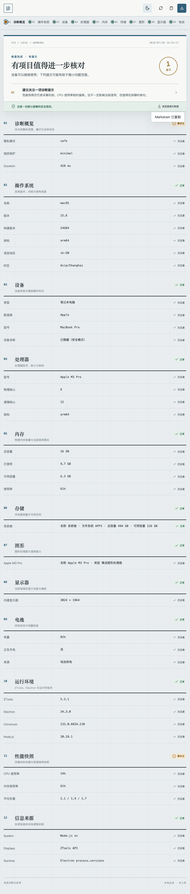

# 系统诊断报告

## ZTools 兼容性

- ZTools 3.2：导出后的 Markdown/JSON 可使用 `startDrag` 拖到外部应用；ESC 隐藏期间采集会在 Preload 安全完成，重新进入不会重复启动采集。
- ZTools 2.4–3.1：保留采集、复制、保存和文件夹工作流；缺少 `startDrag` 时不会显示拖出入口。
- 低于 2.4：插件只显示升级提示，不启动采集或后台任务。

一个面向 ZTools 的本地系统信息查看与诊断报告生成工具。它把排障时常用的软硬件信息集中到一处，并提供适合复制或保存的报告，减少在不同系统设置与命令行工具之间来回查找的成本。



## 功能

- 汇总操作系统、处理器、内存、显卡、系统卷、电池、显示器和运行环境信息。
- 按模块展示采集进度、成功结果与失败原因；单个模块失败不会阻断其余信息。
- 手动刷新，重新获取当前设备状态。
- 生成结构化诊断报告，并复制为文本或保存到本地文件。
- 采集结果进入页面前即移除用户名、设备名、序列号、网络地址等敏感标识。
- 适配 ZTools 的浅色与深色外观。

可以通过以下固定关键词打开插件：`系统诊断`、`系统信息`、`诊断报告`、`电脑配置`、`硬件信息`。

## 隐私与安全

系统信息由插件的 preload 层在当前设备本地读取，展示、脱敏和报告生成均在本地完成。插件不会主动上传诊断数据，也不依赖远程诊断服务。用户名、主机名、序列号、UUID、MAC/IP 地址、环境变量、进程列表与已安装软件不属于报告输出字段；即使底层数据意外包含这些键，隐私过滤器也会在返回页面前移除。

默认的安全模式还会清理文本中可能出现的用户目录、邮箱与网络地址。preload 也保留了更严格的 `fingerprint-minimal` 采集选项，供后续界面或集成调用：它会进一步降低系统版本精度，隐藏设备/显卡型号与存储挂载细节，并按区间归整内存、磁盘和显存容量。

建议在向他人发送报告前仍做一次人工检查。即使启用脱敏，设备型号、系统版本、硬件规格和软件运行环境的组合也可能具有一定识别性。保存报告时，文件只会写入用户在保存对话框中明确选择的位置。

preload 只向页面暴露诊断所需的窄接口，不向页面直接开放 `fs`、`child_process` 等完整 Node.js 模块。其源码与运行依赖保持可读、未混淆，便于审核。

## 支持平台

| 平台 | 标识 | 状态 |
| --- | --- | --- |
| macOS | `darwin` | 支持 |
| Windows | `win32` | 支持 |
| Linux | `linux` | 支持；具体字段受发行版、桌面环境与系统命令可用性影响 |

跨平台字段会尽量归一化，但系统本身未提供、权限不足或命令不可用时，对应字段会标记为不可用，不会伪造值。

## 采集字段

| 分类 | 主要字段 |
| --- | --- |
| 概览 | 报告结构版本、采集时间、隐私模式、平台、架构 |
| 操作系统 | 平台、发行版、版本、代号、内核、架构、UEFI 状态 |
| 设备 | 制造商、型号、硬件版本、是否为虚拟设备 |
| 处理器 | 制造商、型号、物理/逻辑核心数、处理器数量、主频、插槽 |
| 内存 | 物理内存总量、已用量、可用量、使用率、交换空间及其使用率 |
| 存储 | 系统卷的文件系统、类型、总/已用/可用容量、使用率、只读状态；不枚举用户卷和网络挂载 |
| 图形 | 图形控制器厂商与型号、总线、显存、动态显存状态 |
| 显示器 | 分辨率、工作区、缩放、旋转、色深、刷新率、主屏/内建屏状态 |
| 电池 | 是否存在、电量、充电状态、循环次数、剩余时间、电压、容量与健康度 |
| 运行环境 | ZTools、Electron、Node.js 版本与系统开机时长 |
| 性能快照 | CPU 总/用户/系统负载、内存使用率、采集耗时 |
| 信息来源 | 各模块的数据提供者、成功/降级/不可用状态与耗时 |

插件只采集生成上述摘要所必需的系统元数据，不读取文档内容、浏览记录、密码、密钥或其他个人文件内容。

## 本地开发

要求使用当前 Node.js LTS 与 npm。

```bash
npm ci
npm run dev
```

开发服务器固定运行于 `http://127.0.0.1:5173/`，与 `public/plugin.json` 中的 `development.main` 一致。

## 构建与测试

```bash
npm run typecheck
npm test
npm run build
```

`npm run build` 会依次执行类型检查、测试、Vite 构建、安装 dist 中 preload 所需的生产依赖，并运行 `scripts/verify-dist.mjs`。产物校验覆盖：

- 入口 HTML、插件清单、图标和 preload 等必需文件是否齐全；
- `plugin.json` 与 `package.json` 的版本是否一致；
- 页面引用的 JS/CSS 等构建资源是否真实存在；
- preload 声明及源码引用的依赖能否从发布目录解析；
- preload 中是否混入疑似压缩、分块或打包产物。

仅需单独检查已有构建产物时：

```bash
npm run build
# 或在 dist 已存在时
node scripts/verify-dist.mjs
```

## 在 ZTools 中加载 dist

1. 运行 `npm run build`，确认产物校验通过。
2. 打开 ZTools 开发者工具或插件开发入口。
3. 选择本项目的 `dist` 目录；不要选择仓库根目录或 `src` 目录。
4. 用任一固定关键词唤起插件，分别检查采集、刷新、复制和保存报告。
5. 发布时提交完整 `dist` 运行产物，其中 preload 源码与其生产依赖必须保持原有目录结构。

## 已知限制

- 可用字段取决于操作系统版本、权限、硬件驱动、虚拟化环境与底层系统命令；部分信息可能显示为不可用。
- Linux 发行版和桌面环境差异较大，显卡、显示器、磁盘或发行版信息的完整度可能不同。
- 本插件不枚举网络接口、进程、已安装应用，也不执行磁盘健康扫描或硬件压力测试。
- 虚拟机、容器、远程桌面与兼容层可能返回虚拟硬件或宿主裁剪后的数据。
- 存储、内存和频率值可能因系统口径、缓存与采样时刻而有轻微差异，不用于性能基准测试。
- 脱敏用于降低意外泄露风险，不能保证报告绝对匿名；对外分享前仍应人工复核。
- 本插件提供信息汇总，不会自动修改系统配置，也不能替代厂商硬件检测、恶意软件扫描或专业故障诊断。

## 目录说明

```text
public/plugin.json       ZTools 插件清单
public/logo.svg          插件图标
public/preload/          可审核的本地诊断能力桥
src/                     Vue 界面源码
scripts/verify-dist.mjs  发布产物完整性校验
tests/                   Node.js 测试
dist/                    可直接加载到 ZTools 的构建产物
```
