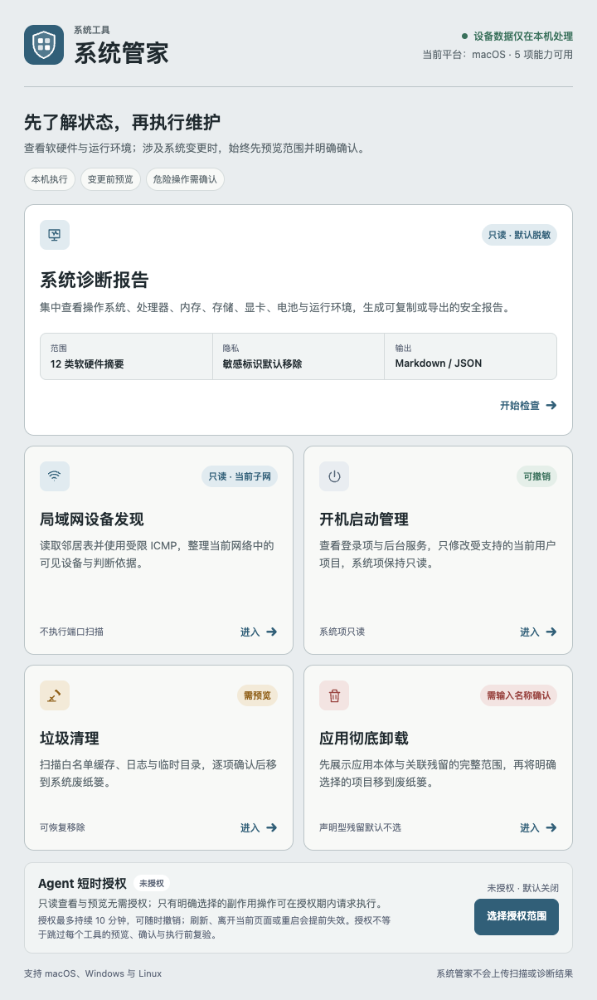

# 系统管家

系统管家把系统诊断与四项常用本地维护能力发布为一个 ZTools 插件，并保留各模块独立的安全边界、测试与可审核 preload 源码。



| 功能 | Feature code | 主要边界 |
|---|---|---|
| 系统诊断报告 | `system-diagnostic-report` | 只读采集、默认脱敏、本地生成并由用户选择导出位置 |
| 应用彻底卸载 | `application-uninstaller` | 完整预览、用户级范围、明确确认后移入废纸篓 |
| 开机启动管理 | `startup-manager` | Linux/Windows 受控用户项可撤销；macOS 启动项只读 |
| 垃圾清理 | `system-cleaner` | 白名单目录、预览优先、可恢复删除 |
| 局域网设备发现 | `lan-device-discovery` | 被动邻居表与受限 ICMP，不做端口或漏洞探测 |

五个 Feature 均显式支持 macOS、Windows 和 Linux。实际可见项目和系统命令仍受当前平台、权限与桌面环境影响。

插件升级或退出时会先进入关闭状态：新的 Agent 副作用请求会返回 `SHUTTING_DOWN`，已开始的请求最多等待 200ms；应用卸载和启动项修改会把中断进度写入受限恢复记录，下一次进入只核对状态，不会自动重试。垃圾清理仍只把项目移入可恢复的系统废纸篓，局域网扫描有 12 秒上限且可取消，系统诊断 helper 也有独立超时与进程树清理；升级边界之外若已有底层系统调用，结果以模块返回值或恢复记录为准。

## 单插件结构

```text
system-manager/
├── public/                  # 根 manifest、dashboard 与统一 preload
├── modules/                 # 五个可独立测试、仅供套件组装的内部模块
├── scripts/                 # 顺序构建、组装、审计与 ZIP 生成
├── tests/                   # workspace、路由和最终发布物整合测试
├── CHANGELOG.md             # 面向插件升级审核的版本更新记录
├── dist/                    # 单一 ZTools 发布目录（构建生成）
└── release/system-manager-0.2.1.zip
```

最终 `dist` 只保留根 `plugin.json`。模块发布物位于 `dist/modules/<feature-code>/`，其嵌套 manifest 会在组装时删除。每个模块 HTML 都会注入位于文档流首部的统一 SuiteBar，共用 `_system-manager/navigation.js` 和 `_system-manager/navigation.css`。

根 dashboard preload 额外暴露：

```js
window.systemManagerSuite.openFeature(featureCode)
window.systemManagerAgentAccess.getState()
window.systemManagerAgentAccess.grant({ scopes })
window.systemManagerAgentAccess.revoke()
```

`featureCode` 必须命中五项固定 allowlist。未知、继承属性或越界路由会返回 `false`。Agent 授权桥只出现在可信 dashboard；五个模块页在 renderer 导航后会重新注册同一组 MCP handler，但仍只获得各自唯一业务桥；未知页面不获得路由、业务桥、Agent 授权或 MCP 注册。

## Agent 工具（ZTools 2.4+）

Agent 工具要求 **ZTools 2.4 或更高版本**。宿主从 `plugin.json.tools` 读取声明，通过根 preload 的 `window.ztools.registerTool(name, handler)` 同步注册；对外名称由宿主自动加上 `system_manager_` 前缀。旧版宿主会安全跳过工具注册，图形界面与模块路由仍可使用。冷启动只需加载根 preload；22 个 handler 会在宿主的 5 秒等待窗口内完成注册，五个业务模块直到对应工具或页面实际使用时才按需加载。

已针对 **ZTools 3.0.2** 验证：主题色变量动态注入、单一 `onPluginOut` 生命周期回调、插件运行中升级，以及更新入口不会改变现有 MCP 注册和页面路由。3.0.2 目前没有要求系统管家迁移到新的用户资料、文件剪贴板或截图参数 API；这些能力仍按插件现有边界保持未使用。

工具默认是只读的：能力查询、诊断采集/渲染、应用/启动项/垃圾清单及局域网接口查询均不需要授权。产生写入或主动网络流量前，用户必须在系统管家 dashboard 明确授予以下一个或多个 scope：

| Scope | 允许的副作用 |
|---|---|
| `report_export` | 打开系统保存对话框，并把缓存中的脱敏报告写到用户明确选择的位置 |
| `application_removal` | 应用/残留处理；仅将当前平台支持且已复验的所选项目移入废纸篓，部分平台只处理用户级残留 |
| `startup_changes` | 修改或撤销受支持的用户级启动项；可能立即启动或停止相应用户服务 |
| `system_cleanup` | 仅将白名单内、复验通过且属于当前用户的垃圾项目移入废纸篓 |
| `lan_scan` | 在选定接口上发送有界 ICMP；最多每 15 秒启动一次，可选 DNS 解析默认关闭，不做端口、公网或漏洞扫描 |

scope 授权最长 10 分钟，可随时撤销，并且只保存在当前 dashboard renderer 的内存中；离开或刷新 dashboard、重启插件都会立即失效。应用处理、新的启动项启停、垃圾清理与 LAN 扫描还必须先调用对应 `prepare_*` 工具取得带摘要与摘要指纹的单次 `actionId`；action 90 秒后失效，执行时会再次复验。启动项撤销则只接受最近一次成功变更返回且仍有效的 `operationId`。副作用调用要求 8–128 字符的 `idempotencyKey`；当前 renderer 会话内最近 10 分钟最多保留 100 条执行记录，可用 `get_operation_result` 查询且不会重放操作。`get_capabilities` 与查询结果都会返回 `runtimeSessionId`；根 MCP 结果仍是会话内存数据，但启动项 rollback 与应用卸载逐项 operation/result 会在 preload 私有 journal 中短暂持久化并在新会话 reconcile/核对。授权不足或 LAN 限速这类 action 消费前失败不会占用幂等键，action 一旦消费，其成功或失败结果都会保持稳定。

ZTools 的 `registerTool` 当前不提供逐调用宿主审批提示，因此系统管家不把注册本身当作用户同意。安全补偿包括：dashboard 短时 scope、默认只读、90 秒预览 action、执行前复验、幂等日志、有界缓存/分页/数组、固定平台 allowlist、错误脱敏，以及应用处理和清理仅移入可人工恢复的废纸篓。`copyText`、`revealPath`/`reveal` 和 `cancelScan` 仍是 UI-only 辅助能力，不注册为 Agent 业务工具。

22 个本地工具按能力分组为：

- 通用与诊断：`get_capabilities`、`collect_diagnostic_report`、`render_diagnostic_report`、`export_diagnostic_report`、`get_operation_result`；
- 应用：`scan_applications`、`list_applications`、`inspect_application`、`prepare_application_removal`、`execute_application_removal`；
- 启动项：`scan_startup_items`、`list_startup_items`、`prepare_startup_change`、`set_startup_item_enabled`、`undo_startup_change`；
- 垃圾清理：`scan_system_junk`、`list_system_junk`、`prepare_system_cleanup`、`clean_system_junk`；
- 局域网：`list_network_interfaces`、`prepare_lan_scan`、`scan_lan_devices`。

## 开发与验证

依赖统一通过 npm workspaces 安装；建议显式把缓存放在插件目录：

```bash
npm_config_cache="$PWD/.npm-cache" npm install
npm_config_cache="$PWD/.npm-cache" npm test
```

`npm test` 会执行以下完整链路：

1. 按固定顺序执行五个 workspace 的 `build:dist`；各模块仍运行自身 typecheck 与测试，并删除中间 manifest 和旧的独立 release，不能作为单独插件发布。
2. 复制 dashboard、根 manifest/preload 和五个模块 dist；系统诊断唯一的生产依赖 `systeminformation@5.33.1` 先同时通过根锁文件 SRI 与 27 个固定文件的 SHA-256 清单，再复制到其 preload 目录并复验。
3. 删除嵌套 `plugin.json`，向模块 HTML 注入返回导航。
4. 验证五个 Feature、三平台声明、preload 依赖、路由 allowlist 和发布内容。
5. 拒绝 source map、开发目录、符号链接、不可审核 preload、依赖包内额外或被修改的文件，以及诊断模块唯一锁定依赖之外的任何 `node_modules` 内容。
6. 为 dashboard 与五个模块统一注入严格生产 CSP，移除开发服务器和 `unsafe-inline` 来源。
7. 通过同目录临时文件和原子 rename 生成 ZIP，并逐 entry 校验名称、CRC、长度、压缩方法、local/central 偏移、重复项及与当前 dist 一致的 SHA-256；rename 前同步文件，rename 后同步发布目录（平台支持时）。
8. 对 `dist` 与 ZIP 分别执行严格 `< 15 MiB` 门禁。

单独重新校验或打包：

```bash
npm run verify
npm run package
```

## 隐私与限制

- 所有数据默认只在本机处理，不由系统管家上传。
- 系统诊断只采集软硬件摘要：操作系统来自 Node `os`，系统盘只读取单一根卷统计；不会调用会读取主机名、序列号、UUID 或全部挂载的宽泛接口。处理器、内存、显卡、电池和负载探测在受控的独立 helper 子进程中执行；超时会终止整棵进程树，常规路径只在确认退出后结算。如果清理确认在 2 秒看门狗内仍无法完成，调度器会熔断并返回通用采集失败，同时拒绝排队与后续 helper，避免页面永久等待或继续扩大未知子进程。`graphics` 与 `battery` 的依赖实现可能在 helper 内短暂读取额外硬件字段，但 helper 内外两次固定投影会阻止这些字段跨进程、进入 preload、页面或报告。设备制造商与型号默认标记为不可用。对外分享前仍建议人工复核。
- 卸载、启动项修改和垃圾清理均属于有副作用操作：图形界面通过对应模块预览确认，Agent 则必须通过 dashboard 短时 scope 与 `prepare_*` 两阶段复验（启动项撤销使用既有 `operationId`）。
- 局域网发现仅使用本地邻居信息和受限 ICMP；ICMP 无响应不代表设备离线。
- 详细威胁模型、路由与发布边界见 [SECURITY.md](SECURITY.md)。
