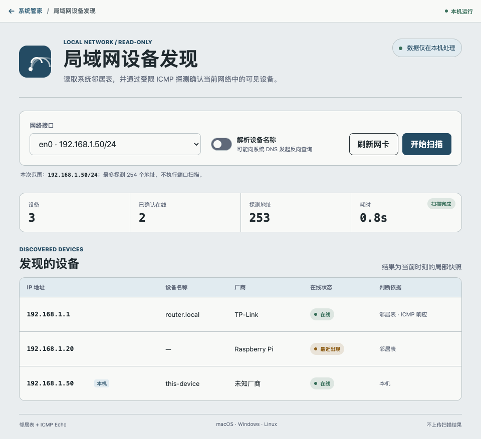

# 局域网设备发现

一个克制、透明的 ZTools 局域网可见性工具。它读取操作系统已有的邻居表，并在用户明确点击“开始扫描”后，对当前 IPv4 网段执行有界 ICMP Echo 探测。



## 能力边界

- 支持 macOS、Windows 与 Linux。
- 展示 IP、可选反向解析名称、本地 OUI 厂商判断和在线状态。
- 最多探测 254 个地址；小于 `/24` 的大网段只处理本机所在的 `/24` 切片。
- 仅允许 RFC1918 私网与 `100.64.0.0/10` 共享地址网卡；不会扫描公网地址。
- VPN、虚拟网卡、桥接网卡和 `100.64.0.0/10` 共享地址网卡默认不扫描，必须单独勾选二次确认。Linux 容器/CNI 常见的 `cni0`、`flannel.1`、`podman0`、`docker0`、`br-*`、`veth*` 等名称会按虚拟接口处理；无法与常见物理网卡命名（如 `enp*`、`eth*`、`wlan*`、`Ethernet`）匹配的非典型名称也默认要求确认。
- ICMP 并发固定不超过 12，单地址等待约 700ms，总扫描时间最多 12 秒。
- 支持立即取消；取消会终止仍在运行的 ping 子进程并停止派发后续任务。
- 不进行端口扫描、服务识别、横向连接、漏洞检测或远程 HTTP 请求。
- 扫描结果只保留在当前插件页面，不上传、不写入磁盘。

## 如何判断状态

| 状态 | 含义 |
|---|---|
| 在线 | 本机、收到 ICMP 响应，或系统邻居表明确标记为 reachable |
| 最近出现 | 邻居表中存在 stale/delay/probe 记录，但 ICMP 没有响应 |
| 状态未知 | 只有不足以确认实时在线的本地证据 |

ICMP 无响应不等于离线。设备防火墙、AP 隔离、访客网络、VLAN、VPN 和休眠都会影响结果。插件只能发现当前二层网络中本机可见的部分设备。

## 跨平台数据源

- macOS：`/usr/sbin/arp -an -i <网卡>` 与 `/sbin/ping -S <源地址>`。
- Windows：绝对系统路径下的 `ARP.EXE -a -N <源地址>` 与 `PING.EXE -S <源地址>`，并校验输出 Interface 区段。
- Linux：优先读取并按网卡过滤 `/proc/net/arp`，必要时使用绝对路径 `ip -j neigh show dev <网卡>`；ICMP 使用绝对路径 `ping -I <源地址>`。

所有命令均从内置绝对路径白名单解析，使用固定参数数组启动，`shell` 永远关闭。扫描开始前会重新枚举并精确核对网卡身份；扫描中网卡变化会立即取消。界面不能传入目标 IP、可执行文件、命令参数、并发量或超时时间。

设备名称解析默认关闭。开启后只对已发现的本地地址使用操作系统 DNS 配置执行反向查询；查询可能到达网络配置的 DNS 服务器。

## 厂商数据

`public/preload/data/oui.json` 是从 [IEEE Registration Authority 公共 OUI 注册表](https://standards-oui.ieee.org/) 挑选的常见前缀子集，更新时间记录在数据文件中。它不是完整厂商数据库；未知前缀会显示“未知厂商”，本地管理或随机 MAC 会明确标注。

## 开发与验证

```bash
cd ../..
npm install
npm test
```

该目录是系统管家的内部 workspace，不再生成可独立安装的 manifest 或 ZIP。唯一受支持的发布物由根目录构建并统一应用页面级 preload 隔离、生产 CSP 与体积门禁。

## 发布结构

前端由 Vue 3 + TypeScript + Vite 构建；preload 仅使用 Node.js 内建模块，以可读 CommonJS 源码随插件发布，不依赖原生二进制或第三方扫描库。
