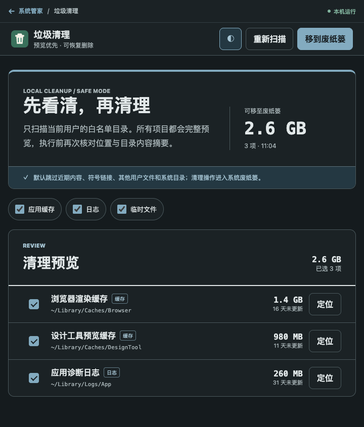

# 垃圾清理

面向 ZTools 的本地安全清理插件。它扫描当前用户的缓存、日志和临时文件目录，在执行前展示每个候选项目的位置、大小、类型与更新时间，并将确认项目移入系统废纸篓。磁盘空间会在用户清空废纸篓后释放。



## 安全原则

- **预览优先**：扫描和清理分为两个阶段，默认仅勾选达到安全时间阈值的项目。
- **白名单范围**：目录由可信 Home 按平台固定推导，忽略 `TMPDIR`、`TEMP`、`LOCALAPPDATA` 等环境重定向；页面不能提交任意路径。
- **可恢复操作**：通过 Electron `shell.trashItem` 移入系统废纸篓，不调用 `rm -rf`。
- **执行前复核**：扫描记录真实路径、设备号、inode、大小、修改时间、类型和整棵目录树的元数据摘要；执行前再次核对，深层内容发生变化也会拒绝。
- **保守跳过**：配置根先 `lstat`，再核对 canonical 根的设备号与 inode，根目录 symlink/junction 或检查期替换会被拒绝；候选也不跟随符号链接。需要所有权复核的临时目录会检查候选及其全部后代，任何其他用户内容都会使整个候选被跳过。
- **一次性快照**：扫描结果两分钟过期且只能执行一次，避免重复点击和陈旧选择。

详细威胁模型见 [SECURITY.md](SECURITY.md)。

## 平台范围

| 平台 | 扫描范围 |
| --- | --- |
| macOS | `~/Library/Caches`、`~/Library/Logs`、符合 `/private/var/folders/.../T` 结构的当前用户临时目录 |
| Windows | 可信 Home 下固定的 `AppData\\Local\\Temp`、CrashDumps、Windows 网络缓存 |
| Linux | `~/.cache`、固定 `/tmp` 中经所有权复核的当前用户项目 |

插件不会扫描文档、下载、照片、项目目录、浏览器配置、密码、Cookie 或系统级目录。临时目录中只处理属于当前用户的直接子项。

## 与 Mole 的关系

本插件参考 [tw93/Mole](https://github.com/tw93/mole) 的安全理念：dry-run/预览优先、保护目录、白名单、符号链接防护和保守拒绝。Mole 使用 GPLv3；本插件没有复制、改写或嵌入 Mole 源码，也不包含 Mole 二进制。

## 开发与验证

```bash
cd ../..
npm install
npm test
```

该目录是系统管家的内部 workspace，不再生成可独立安装的 manifest 或 ZIP。唯一受支持的发布物由根目录构建并统一应用页面级 preload 隔离、生产 CSP 与体积门禁。

## 已知限制

- 文件大小扫描采用流式枚举，并设置时间、深度和条目上限；无法完整核对的候选不会进入清理列表。
- 无权限读取的目录会跳过并显示提示。
- 项目在扫描后发生变化时不会清理，需要重新扫描。
- 清理只负责移动到系统废纸篓，并返回“已移动”字节数而非“已释放”字节数；最终空间释放取决于用户何时清空废纸篓。
