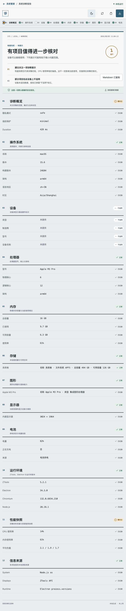

# 系统诊断报告（系统管家内部模块）

该模块在系统管家中只读采集软硬件摘要，并生成适合排障、复制和导出的脱敏报告。它只作为 `system-manager` 的内部 workspace 构建，不应绕过根 preload 页面隔离、统一 CSP 与依赖审计单独发布。



## 能力与边界

- 汇总操作系统、处理器、内存、单一系统卷、显卡、显示器、电池、运行环境和性能快照；设备制造商与型号默认标记为不可用。
- 处理器、内存、显卡、电池和负载探测只允许五个固定方法，并分别在受控的独立 helper 子进程中运行；单项超时会终止整棵进程树，常规路径只在确认退出后结算，且不会丢失已成功获得的信息。若 2 秒看门狗仍无法确认清理，调度器会熔断、结算为通用失败并拒绝所有排队与后续 helper，不让页面永久等待，也不再扩大未知子进程。
- 操作系统使用 Node `os`，系统卷使用单根 `statfs`；不调用会读取主机名、序列号、UUID 或枚举全部挂载的 `osInfo`、`system`、无参数 `fsSize`。
- helper 内与 preload 信任边界都会执行固定字段投影；`graphics` 与 `battery` 的依赖实现可能在 helper 内短暂读取额外硬件字段，但这些字段不会跨进程、进入页面或报告。报告不会包含用户名、主机名、序列号、UUID、MAC/IP、完整用户路径、环境变量、进程和软件清单。
- 支持复制 Markdown，以及通过 ZTools 保存对话框导出 Markdown 或 JSON。
- 保存内容严格限制为 20 MiB，只写入用户明确选择的位置。
- 不上传报告，不执行压力测试，不枚举用户卷、网络挂载、进程或已安装软件。

即使经过脱敏，系统版本与硬件组合仍可能具有识别性；对外分享前应人工复核。

## 套件集成

- Feature：`system-diagnostic-report`
- Bridge：`window.systemReport`
- 方法：`collect`、`copyText`、`saveReport`
- Preload：可读 CommonJS 源码 `public/preload/services.cjs`
- 唯一生产依赖：精确锁定的 `systeminformation@5.33.1`

根构建仅复制 `systeminformation` 的普通包目录，并在复制前后将 27 个文件逐项比对固定 SHA-256 清单；清单同时绑定根锁文件 SRI。构建拒绝内容漂移、额外文件、`.bin`、生命周期脚本、符号链接、额外包与其他 `node_modules`。

## 开发与验证

在系统管家根目录安装依赖并运行完整套件：

```bash
npm ci --ignore-scripts
npm test
```

模块定向验证：

```bash
npm run typecheck --workspace system-diagnostic-report
npm test --workspace system-diagnostic-report
npm run build:dist --workspace system-diagnostic-report
```

模块 `dist/plugin.json` 会被共享 finalizer 删除；唯一可加载和发布的产物是系统管家根目录生成的 `dist/` 与 `release/system-manager-0.2.1.zip`。
