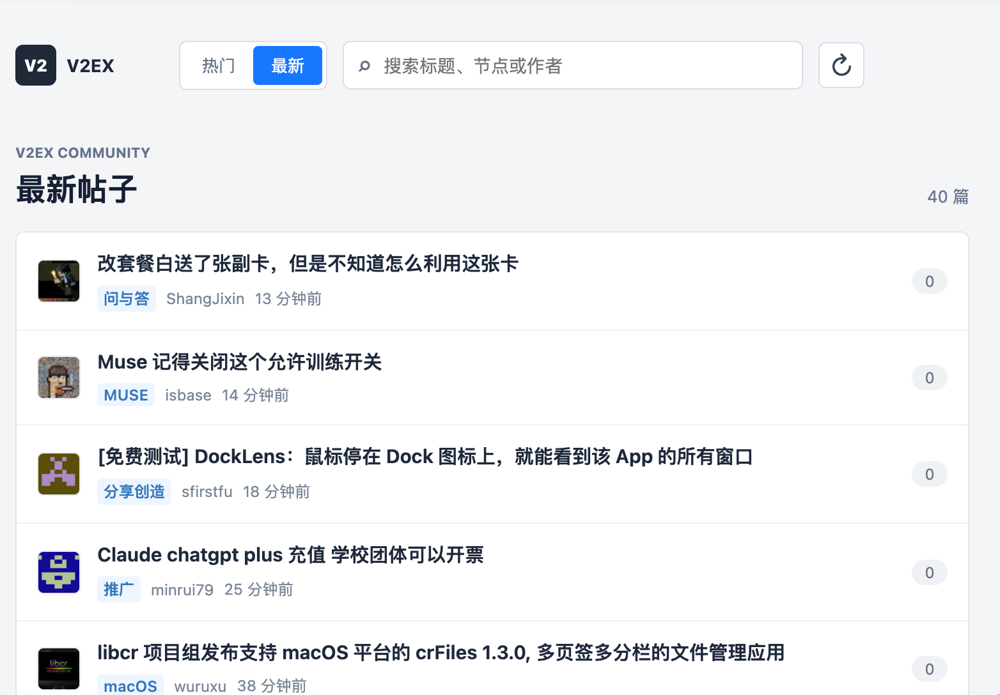
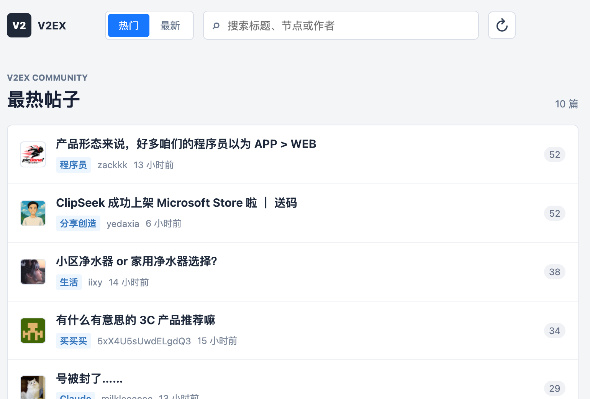
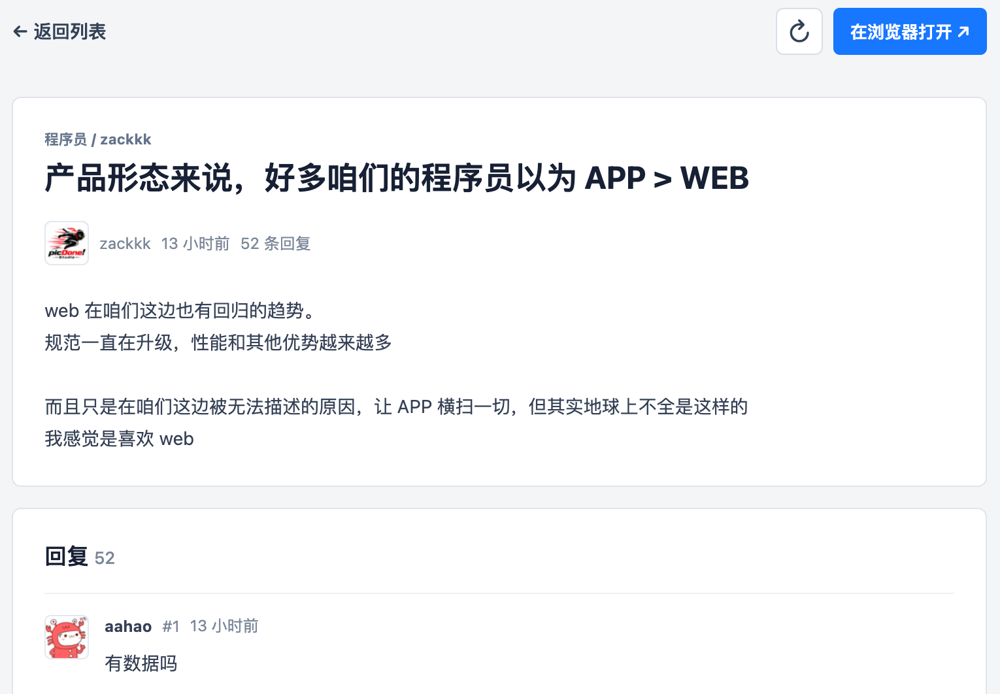

# V2EX 帖子浏览

一个运行在 [ZTools](https://github.com/ZToolsCenter/ZTools) 中的 V2EX 阅读插件。输入 `v2ex` 或 `v2`，即可快速查看热门与最新帖子、筛选内容、阅读详情和回复。

## 演示

### 最新帖子



### 最热帖子



### 帖子详情与回复



## 功能

- 查看 V2EX 最热与最新帖子。
- 按标题、节点或作者过滤当前列表。
- 在插件内阅读帖子正文和回复。
- 一键在系统浏览器打开 V2EX 原帖。
- 热门列表缓存 10 分钟，最新列表缓存 2 分钟；刷新按钮立即重新拉取并更新当前缓存。
- 在网络异常、超时或服务不可用时显示可重试提示，并保留已加载内容。
- 通过 macOS 系统 HTTPS 代理请求 V2EX 和用户头像，避开 ZTools 渲染页的跨域与代理继承限制。

## ZTools 指令

| 指令 | 初始列表 |
| --- | --- |
| `v2ex` | 最热 |
| `v2` | 最热 |

## 开发

需要 Node.js 18 或更高版本。本项目在 Node `v26.10.0` 下验证：

```bash
nvm exec 26 npm install
nvm exec 26 npm run dev
```

开发服务默认运行在 `http://localhost:5173`。ZTools 会根据 `src-ztools/plugin.json` 中的 `development.main` 加载开发版本。

## 验证与构建

```bash
nvm exec 26 npm test
nvm exec 26 npm run build
```

构建产物位于 `src-ztools/dist/`。插件发布包由 `src-ztools/` 下的 `plugin.json`、`logo.png`、`preload/` 和 `dist/` 组成。

## 使用的公开接口

- `https://www.v2ex.com/api/topics/hot.json`
- `https://www.v2ex.com/api/topics/latest.json`
- `https://www.v2ex.com/api/topics/show.json?id=<帖子ID>`
- `https://www.v2ex.com/api/replies/show.json?topic_id=<帖子ID>`

这些接口不需要 Token。插件不收集、不保存 V2EX 账号或访问凭据。
