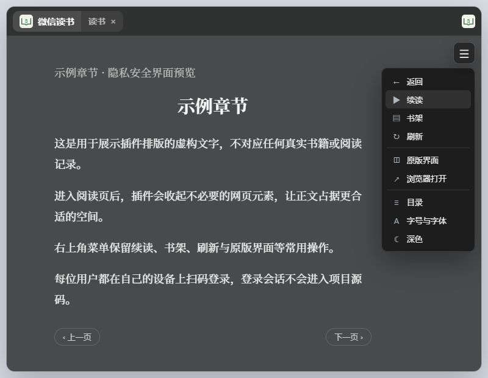

# ZTools 微信读书阅读器

把微信读书官方网页版放进 ZTools，输入“读书”就能继续上次的阅读。

这是一个非官方、纯前端的个人项目。它不使用微信读书 API 登录，也不要求填写账号、密码或 API Key。

## 它能做什么

- 常规阅读直接留在 ZTools 主窗口，也可以按需打开独立的单行阅读条。
- 第一次使用时显示微信读书官方扫码登录页面。
- 打开一本书后，自动记住合法的微信读书阅读页地址。
- 下次输入“读书”时，优先回到上次阅读的书。
- 提供续读、书架、刷新、返回和浏览器打开等常用操作。
- 阅读页默认启用纯净模式，减少顶栏、侧栏和大块留白。
- 支持切回微信读书原版界面。
- 单行阅读支持滚轮逐字移动、键盘换行和自动滚动；横向模式会后台预读后续 3 页，并在页尾或章末无空档续接下一页/下一章。
- 单行阅读条可自定义长度、背景颜色与透明度、字体颜色、字体、字号和粗细。
- ZTools 被 `Alt+Space` 收起时，阅读页面会一起消失。

## 界面预览



> 界面示意使用虚构章节和示例文字，不包含真实账号、二维码、书籍或阅读记录。

## 普通用户安装

不需要安装 Node.js、npm、ZTools CLI，也不需要微信读书 API Key。

推荐直接在 ZTools 插件中心搜索“微信读书”并安装。安装完成后输入 `读书` 即可使用。

也可以从 GitHub 安装源码版：

1. [下载最新版 ZIP](https://github.com/UTAKO-TAKI/ztools-weread-reader/archive/refs/heads/main.zip)。
2. 解压 ZIP，保留整个 `ztools-weread-reader-main` 文件夹。
3. 打开 ZTools 的“开发项目”或“本地开发”入口。
4. 选择“导入开发项目”，然后选择解压目录中的 `plugin.json`。
5. 回到 ZTools，输入 `读书`。

`plugin.json` 是 ZTools 识别本地插件的配置入口，字段说明可参考 [ZTools 官方文档](https://ztoolscenter.github.io/ZTools-doc/plugin-json.html)。

首次打开时，请使用微信扫描官方登录二维码。登录成功后手动打开一本书，以后即可自动续读。

### 更新插件

1. 重新下载最新版 ZIP 并解压。
2. 用新文件替换原来的插件源码目录，或导入新的 `plugin.json`。
3. 在 ZTools 的开发项目页面重新载入插件。

登录会话保存在 ZTools 的本机网页数据中，不在源码目录里。更新源码后通常无需重新登录；如果会话已经过期，重新扫码即可。

### 退出登录或移除插件

- 退出账号：先返回书架或切换到“原版界面”，在微信读书官方页面退出登录。
- 移除插件：从 ZTools 的开发项目列表中移除该项目，再删除解压后的源码目录。
- 如果移除后仍希望清除登录会话，请同时清理 ZTools 中该插件对应的网页数据。

## 可用指令

| 指令 | 作用 |
| --- | --- |
| `读书`、`微信读书` | 打开微信读书，优先恢复上次阅读 |
| `微信续读`、`继续微信读书` | 强制重新打开已保存的阅读页 |
| `微信书架`、`微信读书书架` | 直接打开微信读书首页/书架 |

## 阅读界面

阅读时，右上角默认只显示一个菜单按钮。点开后可以使用：

- 返回、续读、书架和刷新；
- 在系统浏览器中打开；
- 将当前章节打开为独立的单行阅读条；
- 在“纯净阅读”和“原版界面”之间切换；
- 微信读书原有的目录、笔记、字号、主题和阅读模式等功能。

### 单行阅读

进入真实阅读页后，在右上角菜单选择“单行阅读”。窗口默认置顶且不显示任务栏图标，可以拖动阅读条任意非按钮区域调整位置。鼠标离开阅读条后，阅读条会自动隐去；鼠标移回原位置时立即恢复显示。

| 操作 | 作用 |
| --- | --- |
| 鼠标滚轮、`A` / `D`、`←` / `→` | 逐字回退或前进 |
| `W` / `S`、`↑` / `↓` | 切换上一行或下一行 |
| 空格 | 开始或暂停自动滚动 |
| `Esc` | 收起设置，或快速隐藏窗口 |

点击齿轮可调整窗口长度、背景颜色与透明度、字体颜色与透明度、字体、字号、粗细和自动滚动速度。背景色和字体色旁的“取色”按钮可以从屏幕任意位置取色。横向阅读会在后台预读后续 3 页，读到当前页或章节末尾时会直接衔接下一页/下一章；在章首向上滚动会返回上一章。再次从阅读菜单选择“单行阅读”会更新正文并复用现有窗口，不会重复创建多个窗口。

## 隐私与安全

本仓库不包含开发者或使用者的账号、Cookie、阅读记录、书名、登录二维码和本机绝对路径。

插件运行时的数据处理方式如下：

- 微信扫码登录、Cookie 和登录校验全部由 `https://weread.qq.com/` 官方网页完成。
- 登录会话仅保存在本机 ZTools 使用的持久化 webview 会话中，不会写入项目源码。
- 插件只在本机保存最后一次合法的 `https://weread.qq.com/web/reader/...` 地址。
- 只有 `weread.qq.com` 的 HTTPS 地址可以成为插件的加载和续读目标。
- 微信读书远程页面运行在禁用 Node.js 的隔离 webview 中，不能访问插件的文件系统或 ZTools API。

如果希望彻底退出，请先在微信读书页面退出登录，再清理 ZTools 对应的网页会话数据。

## 常见问题

### 打开后要求重新扫码

通常是登录会话过期，或 ZTools 的网页会话数据被清理。重新扫描微信读书官方二维码即可。

### 没有自动回到上次阅读

第一次登录后需要手动打开一本书。插件只有进入真实的 `/web/reader/` 页面后才会保存续读地址。

### 页面一直加载或提示失败

先检查网络，然后使用右上角菜单中的“刷新”或“书架”。也可以选择“浏览器打开”确认微信读书官网是否可访问。

### 微信读书改版后排版异常

纯净模式依赖微信读书网页结构。如果官网改版导致样式失效，可以先在菜单中选择“原版界面”。

### 更新源码后界面没有变化

回到 ZTools 的开发项目页面重新载入插件；仍未更新时，完全退出 ZTools 后重新打开。

## 项目文件

```text
ztools-weread-reader/
├─ docs/images/reader-preview.png  # README 界面示意图
├─ index.html                      # 插件页面和隔离 webview
├─ preload.js                      # ZTools API、地址校验和续读存储
├─ renderer.js                     # 页面导航、菜单及纯净阅读逻辑
├─ styles.css                      # 插件界面样式
├─ single-line.html                # 独立单行阅读窗口
├─ single-line-preload.js          # 单行窗口设置、父子窗口通信
├─ single-line.js                  # 单行推进、快捷键和自动滚动
├─ single-line.css                 # 单行窗口与设置面板样式
├─ webview-preload.js              # 微信读书页内翻页桥接
├─ plugin.json                     # ZTools 插件配置和入口指令
├─ logo.png                        # 插件图标
├─ LICENSE                         # MIT 许可证
└─ README.md                       # 安装与使用说明
```

项目不依赖 npm 包，也不需要构建。修改源码后，在 ZTools 中重新载入开发项目即可测试。

## 兼容性

当前版本主要在 Windows 和 ZTools 3.1.0 环境下测试。微信读书网页版发生改版时，纯净阅读样式可能需要同步调整。

插件已发布到 ZTools 插件中心，同时保留 GitHub 源码分发。

## 许可证

本项目采用 [MIT License](LICENSE) 开源。

## 说明

“微信读书”及相关名称属于其权利人。本项目仅封装官方网页，和微信读书官方没有隶属或合作关系。
