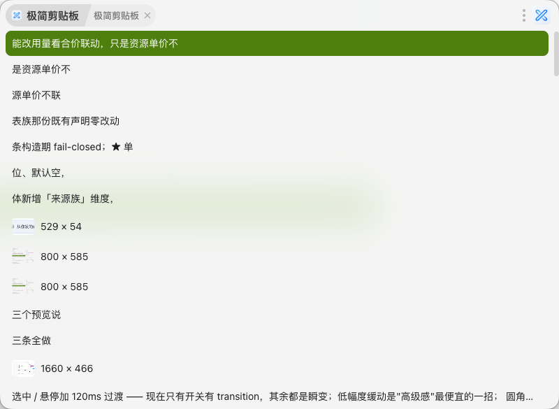
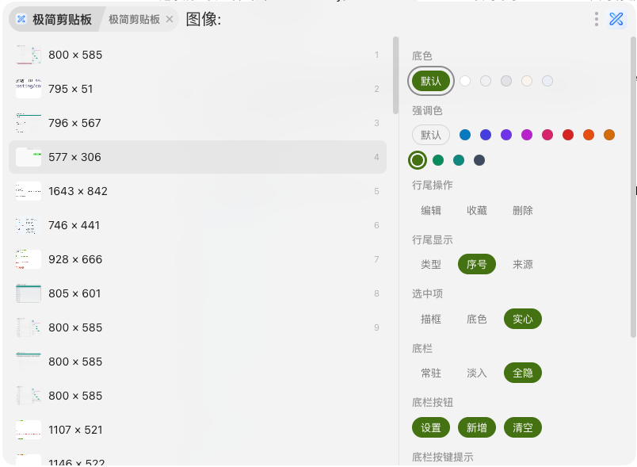
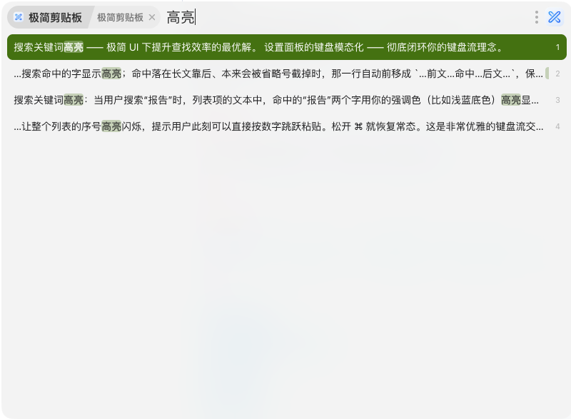

# 极简剪贴板

> ZTools 的剪贴板历史插件。打开就是内容，键盘走完全程。

## 预览

|             列表             |              设置              |            高亮            |
| :--------------------------: | :-----------------------------: | :-------------------------: |
|  |  |  |

## 功能

- **键盘流**：`↑↓` 选、`Enter` 贴、`Tab` 切分类；设置面板里 `↑↓←→Enter` 也能走完
- **五个分类平级**：全部 / 文本 / 图像 / 文件 / 收藏，`Tab` 循环
- **收藏独立**：收藏不掺进历史列表；清历史不影响收藏，清收藏也不影响历史
- **收藏可以手写**：收藏里能「新增」一条备忘（不必先在别处复制），也能「编辑」已有的文本条目
- **按分类清空**：在哪个分类就只清哪个分类
- **搜索高亮**：命中的字铺一层强调色底；命中落在长文靠后时，那一行会自动前移成 `…前文…命中…后文…`
- **详情浮层**：被截断的文本、图片、多文件可以弹出完整内容（默认关，设置里开）
- **图片带缩略图**：`.png` / `.jpg` 之类的图片文件，行首显示缩略图
- **底色可换**：默认不画底，跟顶部搜索框零色差；也可以换成实底
- **底栏可定制**：左边哪几条键位提示、右边哪几颗按钮，一条条挑；形态有 常驻 / 淡入 / 全隐；提示挑多了放不下会**自动换行**
- **跟随 ZTools**：深浅色和强调色都跟着宿主走
- **不弹提示框**：所有操作都没有弹窗打断
- **无依赖**：自写 CSS，不带任何 UI 组件库

---

## 快捷键

| 键                                                                    | 作用                                                       |
| --------------------------------------------------------------------- | ---------------------------------------------------------- |
| `↑` `↓`                                                         | 选择                                                       |
| `PageDown` `PageUp` / `⌘↓` `⌘↑` / `Ctrl+↓` `Ctrl+↑` | 翻一屏，跳过满满一屏                                       |
| `Enter`                                                             | 粘贴到上一个应用                                           |
| `⌘1`–`⌘9` / `Ctrl+1`–`Ctrl+9`                             | 粘贴屏幕上第 1–9 行（行尾开着「序号」时才有编号）         |
| `⌘C` / `Ctrl+C`                                                  | 只复制，不粘贴（窗口不关）                                 |
| `⌘E` / `Ctrl+E`                                                  | 编辑当前这条收藏（只在收藏分类里、且是文本条目时有效）     |
| `⌘K` / `Ctrl+K`                                                  | 收藏 / 取消收藏当前项                                      |
| `⌘L` / `Ctrl+L`                                                  | 一步跳到收藏，再按一次退回全部                             |
| `⌘N` / `Ctrl+N`                                                  | 新增一条收藏（等于右下角那颗「新增」，只在收藏分类里有效） |
| `⌘/` / `Ctrl+/`                                                  | 打开设置                                                   |
| `Tab` / `⇧Tab`                                                   | 下一个 / 上一个分类                                        |
| `Delete`（或 `⌘⌫` / `Ctrl+⌫`）                               | 删除当前项（默认会先确认，可在设置里关掉）                 |
| `Backspace`                                                         | 退搜索框：有词退一个字，只剩分类前缀就把分类也退掉         |
| `/` 或 `⌘F` / `Ctrl+F`                                         | 回到搜索框                                                 |
| `Esc`                                                               | 退一步：先清关键词 → 再清分类 → 再关闭插件               |

**鼠标操作：**

| 操作                         | 作用                                                                |
| ---------------------------- | ------------------------------------------------------------------- |
| 单击行                       | 选中                                                                |
| 双击行                       | 复制（窗口不关）                                                    |
| 行尾`☆` / `🗑` / `✎` | 收藏 / 删除 / 编辑（鼠标划上去才出现；三枚可在设置里各关各的）      |
| 右下角「设置」               | 打开右侧设置面板（可在设置里隐藏，那时按`⌘/`）                   |
| 右下角「新增」               | 手动新增一条收藏（只在收藏里出现，可在设置里隐藏；也可以按`⌘N`） |
| 右下角「清空…」             | 清空当前分类，文案会跟着分类变（也可在设置里隐藏）                  |

> **焦点提示**：按 `↑↓` 的时候，键盘焦点会从搜索框交给插件 —— 焦点不在搜索框时，`⌘K`、`⌘E`、`⌘N`、`⌘C`、`⌘L`、`⌘/`、`⌘1`–`⌘9`、`Delete`、`⌘⌫`、`PageDown` / `PageUp` 才会有效。
> `⌘↓` / `⌘↑`（Windows 上是 `Ctrl+↓` / `Ctrl+↑`）打开插件就能按。

### 设置面板

`⌘/`（或右下角「设置」）打开面板后，方向键就在面板里走，不用鼠标：

| 键            | 作用                                                                                            |
| ------------- | ----------------------------------------------------------------------------------------------- |
| `↑` `↓` | 换一项（光标落到这一项**当前的取值**上，不会顺手改掉任何设置）                            |
| `←` `→` | 在这一项里换一个：颜色移到哪颗就选哪颗，开关是左关右开                                          |
| `Enter`     | 落值 / 切换（「行尾操作」「行尾显示」「底栏按钮」「底栏按键提示」那几组、以及两个开关，都靠它） |
| `Esc`       | 关面板，回到列表                                                                                |

几点行为说明：

- **「行尾操作」「行尾显示」「底栏按钮」「底栏按键提示」那几组都是各自独立的事**，`←→` 只挪光标、**按 `Enter` 才真的切换**。
- **关掉后面的键都还在**：编辑关掉还有 `⌘E`，收藏关掉还有 `⌘K`，删除关掉还有 `Delete`，底栏「设置」关掉还有 `⌘/` —— 按钮管鼠标、键位管键盘，关哪边都不把功能关死。
- **收藏按钮关掉之后，`⌘K` 收藏完会闪一颗星**（约 1 秒后淡掉）；按钮开着的时候不闪。
- **打开面板时，列表那行的选中会收起**，关掉面板就回来。
- **面板不是模态**：只有 `↑↓←→Enter` 五个键被面板吃掉，`Esc`、`Backspace`、打字、`Tab` 切分类都还是原来的作用。

---

## 收藏

收藏是插件自己存的一份，**不掺进历史列表**：清历史不动它，清它也不动历史。

- **收藏某一条**：行尾点 `☆`，或按 `⌘K`（`⌘L` 一步跳到收藏，再按一次退回全部）
- **手动新增**：在收藏里点右下角「新增」（或按 `⌘N`），弹出一个大框写下内容 —— 备忘、常用短语、邮箱地址都行，**不必先在别处复制**
- **编辑**：收藏里的**文本**条目，鼠标划上去，行尾点 `✎`，弹框改正文（或者按 `⌘E`）
- **清空**：右下角「清空收藏」，只清收藏这一摊

写入框里：

| 键          | 作用         |
| ----------- | ------------ |
| `Enter`   | 保存         |
| `⇧Enter` | 换行         |
| `Esc`     | 取消，不保存 |

- 内容为空时「保存」是灰的
- 框是**大框**：宽 776（窗口一共 800，左右各留 12px），高度直接**撑满**弹框可用高度 —— 写长备忘不用一上来就滚，再长才在框里滚
- 只能编辑文本条目 —— 图片和文件没有「正文」可改
- 编辑改的只是**收藏这一份**；剪贴板历史里那条原文不动

---

## 搜索

搜索框本身就是分类开关，输入法直接打中文：

| 写法            | 结果                   |
| --------------- | ---------------------- |
| `全部:报告`   | 在所有历史里搜「报告」 |
| `文本:报告`   | 只在文本里搜           |
| `图像:`       | 只看图像               |
| `文件:readme` | 按文件名搜             |
| `收藏:`       | 在收藏里搜             |

- 不写前缀 = 全部
- 全角冒号也认（输入法直接打出来的那个「：」）
- **命中的字会铺一层强调色底**：当前行那一条更重，其余行轻
- 分类名后面可以跟空格
- 切分类会保住关键词：`文本:报告` 按 `Tab` 变成 `图像:报告`
- **`图像:` 搜不出关键词**：图片记录里本来就没有文字，不带词才是正常用法
- **复制图片文件归「文件」不归「图像」**：从访达 / 资源管理器复制 `.png` 是**文件**（能按文件名搜到），截图或在网页里「复制图像」才是**图像**。两种都显示缩略图
- **搜索框一改，列表就从头看起**：打字、退一格、退光，列表都重新筛过，当前行回到第一条。不会出现「光标停在列表中间」的情况

---

## 设置

右下角「设置」打开右侧面板。改完立刻生效，不用重启插件。

### 底色

- **默认**：不画底，跟顶部搜索框零色差
- **范围**：详情浮层、设置面板、确认框

### 强调色

- **默认**：跟随 ZTools 的主题色
- **范围**：当前行、面板上的色点、底栏入口的悬停色

### 行尾操作

鼠标划过一行时，行尾浮出 `✎` 编辑、`☆` 收藏、`🗑` 删除三枚按钮 —— **鼠标唯一的操作入口**。三颗**各开各的**：

- **编辑**：关掉后行尾没有 `✎`，只能按 `⌘E`（只在收藏分类里、且是文本条目时有效）
- **收藏**：关掉后鼠标不能收藏，只能按 `⌘K`（按了会在那一行闪一颗星，约 1 秒后淡掉）
- **删除**：关掉后只剩 `Delete`

### 行尾显示

列表每行最右边显示什么，**多选**（三个都点掉 = 行尾什么都没有）：

- **类型**：文本 / 链接 / 图像 / 文件
- **序号**：屏幕上前 9 行的编号，配 `⌘1`–`⌘9` 直接粘贴
- **来源**：这条记录来自哪个应用（`VSCode` / `Chrome` / `IDEA`…）。默认关；

### 选中项

选中那一行长什么样，**三档用的是同一个强调色**：

- **描框**：描一圈强调色（默认）
- **底色**：一层 13% 强调色的淡底 + 左端一根 3px 竖条
- **实心**：整行铺满强调色、字反白

**范围**：选中项、底栏入口的悬停、面板里「被选中」的那一颗。

### 底栏

最下面那条分**三件事**：这一行**在不在**（形态）、左边**显示哪几条提示**、右边**显示哪几颗按钮**。后两件都是**多选**，一条条挑。

**形态**（三选一）：

- **常驻**：一直在，占一行高度（默认）
- **淡入**：不占高度，内容一直铺到窗口底边；鼠标贴到最下缘才浮出来
- **全隐**：整行都没有，鼠标也没有入口 —— **这时只能按 `⌘/` 打开设置**

**按键提示**（15 条可选 —— 界面上能按的键都在这里；默认勾 8 条：选择 / 翻页 / 分类 / 粘贴 / 秒贴 / 收藏 / 编辑 / 删除；一条都不要也可以；挑多了放不下会**自动换行**）：

| 提示                                          | 说明                                                                  |
| --------------------------------------------- | --------------------------------------------------------------------- |
| `↑↓` 选择 / `Tab` 分类 / `Enter` 粘贴 | 一直都在                                                              |
| `⌘↓` 翻页                                 | 同`PageDown`（Windows：`Ctrl+↓`）                                |
| `⌘1`–`9` 秒贴                           | 粘贴屏幕上第 1–9 行                                                  |
| `⌘K` 收藏 / `Delete` 删除                | 对当前这一行的操作                                                    |
| `Esc` 返回                                  | 退一步：先清关键词 → 再清分类 → 最后关闭插件；默认不勾              |
| `⌘C` 复制                                  | 把当前这条**写回剪贴板**（只复制，不粘贴、窗口不关）；默认不勾  |
| `⌘L` 收藏夹                                | 一步跳到收藏、再按一次退回全部；默认不勾                              |
| `⌘F` 搜索                                  | 焦点跳回搜索框（同裸`/`）；默认不勾                                 |
| `Backspace` 退格                            | 只退搜索框里的字，**不删数据**（删数据是 `Delete`）；默认不勾 |
| `⌘E` 编辑                                  | **只在收藏分类里显示**（那个分类里它才管用）                    |
| `⌘/` 设置                                  | 默认不勾                                                              |
| `⌘N` 新增                                  | **只在收藏分类里显示**；默认不勾                                |

**按钮**（默认三颗都在，可以只留其中一颗、也可以全不要）：

- **设置**：打开右侧面板。取消之后开面板只剩 `⌘/`
- **新增**：手动新增一条收藏，**只在收藏分类里出现**。取消之后按 `⌘N` 照样能新增
- **清空**：清空当前分类，文案跟着分类变

### 显示详情

选中图片、或内容显示不全的行时，在旁边浮出完整内容；换一行就收起。默认关。

### 删除前确认

默认开：按 `Delete` 会先弹框确认，**关掉之后按 `Delete` 直接删、不弹框**。

---

## 安装

1. 打开 ZTools
2. 从插件中心安装，或本地导入构建好的 `.zpx`
3. 输入 `极简剪贴板` 或 `x-clipboard` 唤出

## 许可

MIT
